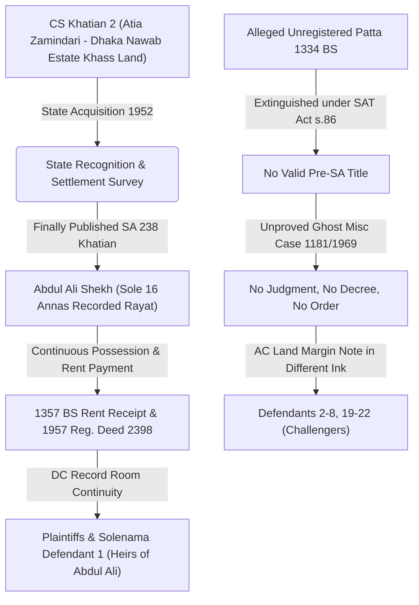
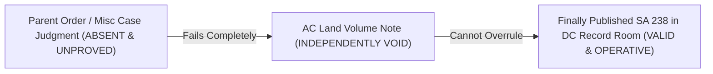
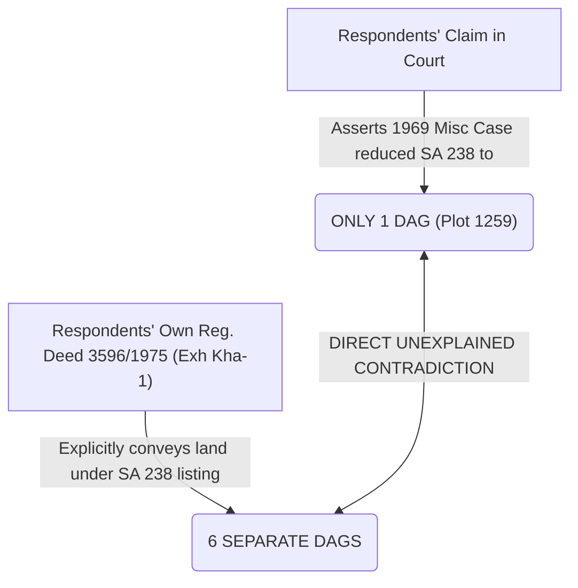

# জেলা জজ আদালত, টাঙ্গাইল
## আপীল মামলা নং ৩৮/২০২৬
### বাটোয়ারা মামলা নং ৬৬/২০১৬, সখিপুর সিভিল জজ আদালত হইতে উদ্ভূত
**হাতেম আলী ও অন্যান্য (আপীল্যান্ট/বাদী) বনাম আলহাজ উদ্দিন ও অন্যান্য (রেসপন্ডেন্ট/বিবাদী)**

**আপীল্যান্টপক্ষের পূর্ণাঙ্গ লিখিত যুক্তিতর্ক (Version 63 — Comprehensive Appellate brief & Strategy)**

**তারিখ:** ৩০ জুলাই ২০২৬ | **আদালত:** জেলা জজ আদালত, টাঙ্গাইল

---

## প্রারম্ভিক বক্তব্য — আপীলের কেন্দ্রীয় প্রশ্ন ও প্রধান ভিত্তি

মহামান্য আদালত,

এই আপীলের নিষ্পত্তির জন্য অসংখ্য জটিল প্রশ্নের উত্তর দেওয়ার প্রয়োজন নাই। মামলাটি মূলত **একটি মাত্র কেন্দ্রীয় প্রশ্নে সীমাবদ্ধ:**

> **"চূড়ান্তভাবে প্রকাশিত এবং আজও জেলা প্রশাসকের সেটেলমেন্ট রেকর্ড রুমে অপরিবর্তিত SA ২৩৮ নং খতিয়ান কি একটি অপ্রমাণিত Misc Case, AC Land অফিসের ভিন্ন কালিতে লেখা একটি ব্যাখ্যাহীন মার্জিন নোট এবং প্রশাসনিক কারসাজি দ্বারা পরাজিত হইতে পারে?"**

আমাদের বিনীত ও দৃঢ় আইনগত উত্তর — **"কখনোই পারে না।"**

মহামান্য আদালত, চূড়ান্তভাবে প্রকাশিত SA ২৩৮ নং খতিয়ান দ্বারা রাষ্ট্র আব্দুল আলীকে একক রায়ত (১৬ আনা প্রজা) হিসেবে স্বীকৃতি দিয়াছে। যে পক্ষ এই State Recognition অস্বীকার করে, সেই পক্ষকেই উহা ভাঙিবার জন্য নির্ভরযোগ্য, আইনসিদ্ধ ও অখণ্ডনীয় प्रमाण উপস্থাপন করিতে হইবে। বিবাদীদের পুরো প্রতিরক্ষা একটি অপ্রমাণিত ও কাল্পনিক Title Story-র উপর দাঁড়াইয়া আছে। 

বিজ্ঞ ট্রায়াল কোর্ট আইনের সুপ্রতিষ্ঠিত Evidentiary Standard এবং Statutory Presumption লঙ্ঘন করিয়া তিনটি মারাত্মক আইনগত ভুল করিয়াছেন:

1. **Root Title প্রমাণের ব্যর্থতা উপেক্ষা:** বিবাদীদের দাবিদাওয়া ১৯৩৪ সালের কথিত অনিবন্ধিত পত্তনভিত্তিক। আইন অনুযায়ী SAT Act, 1950 পাসের পর পূর্ববর্তী অনিবন্ধিত পত্তন বা স্বত্ব সম্পূর্ণ বিলুপ্ত হইয়াছে। ট্রায়াল কোর্ট বিবাদীদের Root Title-এর এই অসারতা উপেক্ষা করিয়াছেন।
2. **Burden of Proof-এর বেআইনি স্থানান্তর:** বাদীপক্ষ চূড়ান্ত প্রকাশিত SA খতিয়ান দাখিল করিয়া initial burden discharge করা সত্ত্বেও ট্রায়াল কোর্ট উল্টো বাদীর উপর দায়িত্ব চাপাইয়াছেন বিবাদীদের কথিত সংশোধন মিথ্যা প্রমাণ করার — যা Evidence Act, Section 103-এর সরাসরি লঙ্ঘন।
3. **Parent Order বিহীন Margin Note-কে প্রাধান্য দান:** একটি আদেশহীন, রায়হীন ও ডিগ্রিহীন কথিত Misc Case No. 1181/1969 এবং AC Land ভলিউমের মার্জিন নোটকে DC Record Room-এর অপরিবর্তিত statutory record-এর উপর বেআইনি প্রাধান্য দেওয়া হইয়াছে।

---

## মামলার Chain of Title — অবিচ্ছিন্ন রাষ্ট্রীয় স্বীকৃতি

### Chain of Title-এর তুলনামূলক চিত্র:

| ক্র. | বাদীপক্ষের অবিচ্ছিন্ন রাষ্ট্রীয় স্বত্ব (Plaintiffs) | বিবাদীপক্ষের ভিত্তিহীন রূপকথা (Respondents) |
|---|---|---|
| ১ | **CS ২ নং খতিয়ান:** ঢাকা নবাব এস্টেটের খাস জমি (কোনো পূর্বতন প্রজা ছিল না)। | **১৯৩৪ সালের কথিত পত্তন:** সম্পূর্ণ অনিবন্ধিত, পাট্টা/কবুলিয়ত নাই, Chief Manager approval নাই। |
| ২ | **SAT Act 1950:** রাষ্ট্রীয় অধিগ্রহণের পর সরেজমিনে আব্দুল আলীর প্রত্যক্ষ দখল স্বীকৃতি। | **SAT Act s.86:** রাষ্ট্রীয় অধিগ্রহণে যেকোনো প্রাক-SA অনিবন্ধিত স্বত্ব স্বয়ংক্রিয়ভাবে বিলুপ্ত। |
| ৩ | **SA ২৩৮ নং খতিয়ান:** চূড়ান্তভাবে প্রকাশিত একক ১৬ আনা রায়তি খতিয়ান (প্রদর্শনী-৪)। | **Misc Case 1181/1969:** কোনো আদেশ, রায়, ডিগ্রি বা সার্টিফাইড কপি আদালতের সমক্ষে দাখিল হয় নাই। |
| ৪ | **DC Record Room:** জেলা প্রশাসকের মূল রেকর্ড রুমে আজও আব্দুল আলীর নাম অপরিবর্তিত। | **AC Land Volume Note:** সখিপুর অফিসে ভিন্ন কালিতে লেখা ব্যাখ্যাহীন নোট (DW-4 কারণ জানেন না)। |
| ৫ | **দখল ও সমর্থক প্রমাণ:** ১৩৫৭ বঙ্গাব্দের খাজনা রশিদ ও ১৯৫৭ সালের রেজিস্ট্রিকৃত দলিল ২৩৯৮। | **নিজের দলিলের সাথে সাংঘর্ষিক:** বিবাদীদের নিজ দলিলে (৩৫৯৬/১৯৭৫) SA ২৩৮-এ ১টি নহে, ৬টি দাগ বর্ণিত। |

---

# ISSUE NO. 1
## SA ২৩৮ খতিয়ান কি এখনও আইনগতভাবে বহাল ও কার্যকর?
### *(State Recognition vs. The Impossible Theory)*

মহামান্য আদালত, **এই মামলার কেন্দ্রবিন্দু মাত্র একটি।** এই আপীলে বাদীপক্ষের বক্তব্য কোনো প্রাক্-SA (Pre-SA) title reconstruction-এর উপর নির্ভরশীল নয়। রাষ্ট্র Estate Acquisition-এর পর নিজস্ব প্রশাসনিক ও জরিপ প্রক্রিয়ার মাধ্যমে SA ২৩৮ নং খতিয়ান প্রস্তুত ও চূড়ান্তভাবে প্রকাশ করে। সেই রেকর্ডে আব্দুল আলী একক রায়ত (১৬ আনা) হিসেবে স্বীকৃত। অতএব বর্তমান বিতর্কের সূচনা বিন্দু ১৯৩৪ সালের কথিত পত্তন নহে; বরং রাষ্ট্র কর্তৃক চূড়ান্তভাবে স্বীকৃত SA Record। 

**যে পক্ষ এই State Recognition অস্বীকার করে, সেই পক্ষকেই উহা ভাঙিবার জন্য নির্ভরযোগ্য ও আইনসিদ্ধ প্রমাণ উপস্থাপন করিতে হইবে।**

### ১.১ State Record এবং ইহার আনুষঙ্গিক সমর্থন (Corroboration)
SA ২৩৮ নং খতিয়ানই বাদীপক্ষের প্রধান ভিত্তি। ১৩৫৭ বঙ্গাব্দের খাজনা রসিদ এবং ১৯৫৭ সালের রেজিস্ট্রিকৃত দলিল কেবল উক্ত State Record-এর সহায়ক ও সমর্থনকারী পরিস্থিতিগত প্রমাণ (corroborative evidence) হিসেবে বিবেচ্য।

**১৯৫৭ সালের রেজিস্ট্রিকৃত দলিলের তাৎপর্য:** 
২৩৯৮/১৯৫৭ নং রেজিস্ট্রিকৃত দলিল দ্বারা প্রমাণিত হয় যে, SA অপারেশন চলমান থাকাকালীন সময়ে আব্দুল আলী সংশ্লিষ্ট মৌজায় স্বীয় নামে প্রকাশ্যে সম্পত্তি ক্রয় ও ভোগদখল করিতেছিলেন। উক্ত দলিলভুক্ত জমিও পরবর্তীতে SA ২৩৮ নং খতিয়ানের অন্তর্ভুক্ত হইয়াছে। ফলে দলিলটি দেখায় যে SA অপারেশন চলাকালীন সময়ে আব্দুল আলী সংশ্লিষ্ট মৌজায় প্রকাশ্য ও স্বীকৃত ভূমি-অধিকারী ব্যক্তি হিসেবে পরিচিত ছিলেন।

> **Shafiullah vs. Sultan Ahmad Mir, 6 BLD (AD) 70:**
> *"Tenancy status is determined by zamindari pattan or state recognition, not by personal law of inheritance."*

> **Government of Bangladesh vs. AKM Abdul Hye, 56 DLR (AD) 53:**
> *"Reverses HCD; confirms that SA and RS records of rights carry full statutory presumption of correctness under Section 144A of the SAT Act until rebutted by clear, cogent and admissible evidence."*

### ১.২ বিবাদীদের "Impossible Theory" (অসম্ভব প্রাতিষ্ঠানিক ভুলের তত্ত্ব)
বিবাদীদের মূল বক্তব্য — আব্দুল করিম প্রকৃত প্রজা ছিলেন, কিন্তু ভুলক্রমে আব্দুল আলীর নামে একক SA রেকর্ড প্রস্তুত হইয়াছে। কিন্তু বিবাদীদের এই তত্ত্ব গ্রহণ করিতে হইলে আদালতকে একযোগে বিশ্বাস করিতে হইবে যে:
- SA জরিপ কর্মকর্তা ভুল করিয়াছেন;
- Khanapuri ও Bujharat পর্যায়ে ভুল ধরা পড়েনি;
- Draft Publication (খসড়া প্রকাশনা) পর্যায়ে কোনো আপত্তি জমা পড়েনি;
- Section 104/105-এর আদেশের বিরুদ্ধে Appeal পর্যায়ে ভুল সংশোধন হয়নি;
- Section 106-এর Revision পর্যায়েও ভুল সংশোধিত হয়নি;
- চূড়ান্ত প্রকাশনার পরও DC Record Room-এ কোনো পরিবর্তন প্রতিফলিত হয়নি;
- বিগত ৫০ বছরের অধিক সময়েও জেলা প্রশাসকের সেন্ট্রাল রেকর্ড রুম সংশোধিত হয়নি।

আইন এতগুলো ধারাবাহিক প্রাতিষ্ঠানিক ভুলের কাল্পনিক অনুমানের উপর স্বত্ব প্রতিষ্ঠা করে না।

---

# ISSUE NO. 2
## Section 144A অনুযায়ী Burden of Proof কার উপর?
### *(The Shift of Evidentiary Burden)*

মহামান্য আদালত, বিজ্ঞ ট্রায়াল কোর্টের সবচেয়ে মারাত্মক আইনি ভুলটি ঘটিয়াছে প্রমাণের দায়িত্ব নির্ধারণে। বাদীপক্ষ আদালতে একটি সুস্পষ্ট Chain of Title প্রদর্শন করিয়াছেন:
$$\text{State Recognition (SA 238)} \longrightarrow \text{DC Record Room Continuity} \longrightarrow \text{উত্তরাধিকার}$$

এই State Record (SA 238) প্রদর্শনের মাধ্যমেই বাদীপক্ষ তাহাদের Initial Burden of Proof সম্পূর্ণভাবে discharge করিয়াছেন।

### ২.১ আইনের সুনির্দিষ্ট বিধান (SAT Act s. 144A & Evidence Act s. 103)
**SAT Act, 1950-এর Section 144A** অনুযায়ী, একটি খতিয়ান চূড়ান্তভাবে প্রকাশিত হইবার পর উহা আইনের দৃষ্টিতে সম্পূর্ণ নির্ভুল বলিয়া গণ্য হয় (Statutory Presumption of Correctness)। 

যিনি দাবি করেন যে এই চূড়ান্ত প্রকাশিত খতিয়ান পরবর্তীতে সংশোধিত হইয়াছে বা ভুল প্রস্তুত হইয়াছে, সেই সংশোধন প্রমাণের **সম্পূর্ণ দায়ভার (Burden of Proof) তাহার উপরই বর্তায় (Evidence Act, Section 103)।**

### ২.২ ট্রায়াল কোর্টের মারাত্মক নেতিবাচক প্রমাণের ভুল (Negative Proof Error)
বিজ্ঞ ট্রায়াল কোর্ট উল্টো বাদীকেই বাধ্য করিয়াছেন এমন একটি কথিত সংশোধন মিথ্যা (disprove) প্রমাণ করিতে — যাহার আইনি অস্তিত্বই বিবাদীরা আদালতে প্রমাণ করিতে ব্যর্থ হইয়াছে। ইহা আইনের চরম লঙ্ঘন।

> **Dayal Chandra Mondal vs. Asst. Custodian, 50 DLR 186:**
> *"A record of rights finally published and revised under section 144A of the S.A.T. Act has a presumption of correctness and that presumption continues till it is rebutted by reliable evidence."*

> **Nuruddin Ahmed vs. Md. Jaman, 45 DLR (AD) 124:**
> *"A trial court sometimes confuses 'plaintiff must prove' with 'plaintiff must disprove every counter-assertion'. This is erroneous and illegal."*

> **Sekandar Ali vs. Md. Ismail, 35 DLR (AD) 230:**
> *"The entry in the record-of-rights carries a statutory presumption of correctness. The onus lies heavily on the party who asserts that the entry is incorrect to prove it by positive evidence."*

---

# ISSUE NO. 3
## কথিত ১৯৩৪ সালের পত্তন ও Misc Case No. 1181/1969 — উভয়ই আইনগতভাবে অকার্যকর
### *(The Double Collapse & The Absence of Parent Record)*

মহামান্য আদালত, বিবাদীদের সমগ্র কাহিনীর জোড়া ভিত্তি — প্রথমটি ১৯৩৪ সালের কথিত পত্তন, দ্বিতীয়টি ১৯৬৯ সালের কথিত Misc Case। আইনগত বিচারে এই উভয় ভিত্তিই তাসের ঘরের মতো ধসে পড়ে (Double Collapse)।

### ৩.১ কথিত ১৯৩৪ সালের পত্তনের সম্পূর্ণ অসারতা
**প্রথমত — Registration Act, 1908-এর লঙ্ঘন:**
এক বছরের অধিক মেয়াদের স্থাবর সম্পত্তির বন্দোবস্ত বা পত্তন রেজিস্ট্রি করা বাধ্যতামূলক (ধারা ১৭)। ধারা ৪৯ স্পষ্টভাবে নির্দেশ করে যে অনিবন্ধিত পাট্টা স্বত্ব প্রমাণের সাক্ষ্য হিসেবে সম্পূর্ণ অগ্রহণযোগ্য।

**দ্বিতীয়ত — SAT Act, 1950-এর ধারা ৮৬ অনুযায়ী স্বয়ংক্রিয় বিলুপ্তি:**
রাষ্ট্রীয় অধিগ্রহণের পর পূর্ববর্তী যেকোনো অনিবন্ধিত পত্তনভিত্তিক দাবি বা প্রাক-SA প্রজা অধিকার আইনের বলেই বিলুপ্ত হইয়াছে।

**তৃতীয়ত — Dhaka Nawab Estate / Court of Wards Rules:**
ঢাকা নবাব এস্টেট Court of Wards-এর অধীনে পরিচালিত হইত। Chief Manager-এর লিখিত অনুমোদন ছাড়া কোনো নায়েব বা তহশিলদারের ইস্যুকৃত পাট্টা/আমলনামা void ab initio।

> **Md. Shajahan Bhuiyan vs. Md. Nurul Alam, 4 SCOB [2015] HCD 52:**
> *"Irrespective of whatever title or right was acquired by virtue of the unregistered patta... it had extinguished as a result of State Acquisition under Section 86 of the SAT Act."*

> **Harun-al-Rashid Mollah vs. Bangladesh, 12 BLC (AD) 79:**
> *"Settlement or rent receipts of Court of Wards / Dhaka Nawab Estate without the signature or written approval of the Chief Manager are void ab initio and confer no title."*

### ৩.২ কথিত Misc Case No. 1181/1969-এর পূর্ণাঙ্গ অনুপস্থিতি
বিবাদীরা ১৯৬৯ সালের ১১৮১ নম্বর মিস মোকদ্দমার কথা মুখে উচ্চারণ করিলেও উক্ত মামলার:
- কোনো লিখিত রায় (Judgment) দাখিল করেননি;
- কোনো আনুষ্ঠানিক ডিগ্রি (Decree) দাখিল করেননি;
- কোনো আদেশনামা (Order Sheet) দাখিল করেননি;
- কোনো সার্টিফাইড কপি (Certified Copy) আদালতে উপস্থাপন করেননি।

**CPC 2(14) vs 2(2) এবং Specific Relief Act धारा 42-এর বাধা:**
- দেওয়ানি কার্যবিধির বিধান অনুযায়ী Misc Case-এ কেবল প্রশাসনিক বা প্রক্রিয়াগত **Order** হয়, কোনো **Decree** প্রদান করা যায় না।
- স্বত্ব ঘোষণা (Declaration of Title) কেবল Specific Relief Act-এর ৪২ ধারার অধীনে দায়েরকৃত নিয়মিত দেওয়ানি স্যুটেই সম্ভব।
- SAT Act-এর ১৪৩/১৪৪ ধারার অধীন রাজস্ব কর্মকর্তা কেবল করণিক সংশোধন করিতে পারেন, কারো মূল স্বত্ব নির্ধারণ বা খর্ব করিতে পারেন না।

> **27 BLD (HD) 544:**
> *"Question of title cannot be decided in a miscellaneous proceeding. Declaration of title requires a properly constituted civil suit."*

> **Evidence Act, Section 114(g):**
> *"If a party fails to produce the best primary evidence in its possession (like the certified copy of order sheet), the court shall presume that such evidence, if produced, would have gone against them."*

---

# ISSUE NO. 4
## AC Land Volume Note কি মূল SA Record-কে পরাজিত করিতে পারে?
### *(The Dependent Invalidity & The Root and Fruit Theory)*

মহামান্য আদালত, এই আপীলের সবচেয়ে গুরুত্বপূর্ণ আইনি ও যৌক্তিক সংযোগটি এখানে অবস্থিত। AC Land কার্যালয়ের ভলিউম নোট কোনো স্বয়ংসম্পূর্ণ আইনি আদেশ নহে; ইহা একটি সাবসিডিয়ারি কার্যকরী নথি (subsidiary working volume) মাত্র।

### ৪.১ The Root and Fruit Theory (মূল ও ফলের তত্ত্ব)
> **"My Lord, when the alleged root order itself is non-existent, the fruit derived from it cannot survive independently in law."**

বিবাদীদের দাবি অনুযায়ী, সখিপুর AC Land অফিসে ভলিউম নোটটি ১৯৬৯ সালের ১১৮১ নং Misc Case-এর আদেশের ভিত্তিতে লেখা হইয়াছিল। 

কথিত Misc Case যদি বিবাদীরা আদালতে প্রমাণ করিতে ব্যর্থ হন (Root is absent), তবে সেই Misc Case-এর ফলাফল হিসেবে দাবি করা Volume Note-ও স্বাধীনভাবে টিকিয়া থাকিতে পারে না (Fruit fails)। Parent order বা মূল রায় প্রমাণ না করিয়া শুধুমাত্র subsidiary register-এর একটি margin note দিয়া Section 144A-এর statutory presumption খণ্ডন করা আইনত অসম্ভব।

### ৪.২ আইনি Mutation-এর ৭টি আবশ্যিক ধাপ — সবকয়টি অনুপস্থিত:

| প্রয়োজনীয় আইনি ধাপ | এই মামলায় বিবাদীদের পক্ষে আছে কি? |
|---|---|
| ১. আনুষ্ঠানিক Mutation আবেদন | **না (নাই)** |
| ২. রেজিস্ট্রিকৃত সুনির্দিষ্ট Case File | **না (নাই)** |
| ৩. রেকর্ডকৃত ১৬ আনা রায়তকে আইনি নোটিশ | **না (নাই)** |
| ৪. ইউনিয়ন তহশিলদারের সরেজমিন তদন্ত প্রতিবেদন | **না (নাই)** |
| ৫. AC Land-এর স্বাক্ষরিত আনুষ্ঠানিক স্বত্ব আদেশ | **না (নাই)** |
| ৬. District Collector Record Room-এ সংশোধন | **না (নাই)** |
| ৭. Register of Alterations (সংশোধন রেজিস্টার)-এ এন্ট্রি | **না (নাই)** |

সাতটি আবশ্যিক ধাপের একটিও পালিত হয়নি। সখিপুর AC Land অফিসে যাহা পাওয়া গিয়াছে, তাহা কোনো বৈধ Mutation-এর ফলাফল নহে — ইহা একটি **Notice-বিহীন, File-বিহীন, Order-বিহীন এবং সম্পূর্ণ বেআইনি কালির নোট।**

### ৪.৩ The Silence of the District Record Room (জেলা রেকর্ড রুমের নীরবতা)
বিবাদীরা দাবি করেন ১৯৬৯ সালে সংশোধন ঘটিয়াছে। তাহা হলে আপীল আদালতের কাছে আমাদের ৩টি উত্তরহীন প্রশ্ন:

1. **Record Room-এর মূল SA খতিয়ান আজও অপরিবর্তিত কেন?**
2. **Register of Alterations-এ কোনো সংশোধন রেকর্ড নাই কেন?**
3. **বিবাদীরা আজ পর্যন্ত কেন জেলা প্রশাসকের রেকর্ড রুমের সংশোধিত Khatian-এর Certified Copy পাইলেন না?**

যদি ১৯৬৯ সালে বৈধ আইনি সংশোধন সংঘটিত হইয়া থাকিত, তবে তাহার প্রতিফলন সর্বাগ্রে ঘটিত District Collector Central Record Room-এর মূল অফিসে। District Record Room-এর ৫০ বছরের নীরবতা AC Land অফিসের ব্যাখ্যাহীন ভলিউম নোটের চেয়ে বহুগুণে অধিক সত্য ও নির্ভরযোগ্য।

> **Shahera Khatun vs. State, 53 DLR 19:**
> *"A volume note or isolated entry in the mutation register carries no statutory presumption of correctness without the underlying parent order."*

> **Fazlur Rahman vs. Bangladesh, 1 BLT (HD) 18:**
> *"SA Khatian changes made in separate ink or handwriting without a parent judicial order sheet are fraudulent and must be excised from the record."*

---

# ISSUE NO. 5
## AC Land-এর এখতিয়ার বহির্ভূত কারসাজি এবং ট্রায়াল কোর্টের Evidentiary Standard Error
### *(Jurisdictional Ultra Vires & Title Adjudication)*

মহামান্য আদালত, বিবাদীপক্ষের দাবিটি খতিয়ানে কোনো সাধারণ 'করণিক ভুল' (Clerical Mistake) বা নাম ও বানানের ভুল সংশোধনের বিষয় নহে। তাহারা দাবি করিতেছেন যে একটি চূড়ান্তভাবে প্রকাশিত রাষ্ট্র-স্বীকৃত SA খতিয়ানে নতুন অংশীদার (co-sharer) যুক্ত করা হইয়াছে এবং মূল রায়তের ১৬ আনা স্বত্ব কাটিয়া খর্ব করা হইয়াছে।

### ৫.১ রাজস্ব কর্মকর্তার এখতিয়ারের সীমা (Jurisdictional Limits)
আইন অনুযায়ী, **AC Land বা রাজস্ব কর্মকর্তার Mutation Jurisdiction স্বত্ব নির্ধারণের (adjudication of title) jurisdiction নহে।** 

রাজস্ব কর্মকর্তা করণিক ভুল শুধরাইতে পারেন, কিন্তু নতুন প্রতিদ্বন্দ্বী অংশীদার সৃষ্টি করিয়া বিদ্যমান ১৬ আনা রায়তের স্বত্ব কাটছাঁট করার কোনো আইনগত এখতিয়ার তাহার নাই। স্বত্ব পরিবর্তন কেবল উপযুক্ত দেওয়ানি আদালতের রায়ের মাধ্যমে ঘটিতে পারে।

> **Mrigangka Mohan Dhali vs. Chitta Ranjan Mondol, 18 SCOB [2023] AD 20 (পাঁচ বিচারপতির আপীল বিভাগীয় বেঞ্চ):**
> *"An administrative ROR entry or procured mutation cannot override an established title or statutory presumption attached to a finally published record."*

> **Aslam vs. Salauddin, 18 BLC (HD) 235:**
> *"A Revenue Officer acting in a mutation case under Section 143 is not a Court. Mutation entries do not create or extinguish title."*

> **29 BLC (HD) 160:**
> *"If in correcting an alleged error in the khatian, the ownership or title of the recorded raiyat is affected, the Revenue Officer has no jurisdiction to touch the record, and the dispute must be referred to the Civil Court."*

### ৫.২ ট্রায়াল কোর্টের Evidentiary Standard Error
বিজ্ঞ ট্রায়াল কোর্ট একটি অপ্রমাণিত Misc Case এবং এখতিয়ার-বহির্ভূত AC Land ভলিউম নোটের উপর ভিত্তি করিয়া বাদীদের ১৬ আনা স্বত্ব খারিজ করিয়া চরম সাক্ষ্যগত ভুল করিয়াছেন।

আপীল্যান্ট বাদীপক্ষ এবং সোলেনামাকারী ১নং রেসপন্ডেন্ট সোলায়মান হোসেন — উভয়েই আব্দুল আলীর বৈধ উত্তরাধিকারী এবং বাটোয়ারায় একমত। একটি তৃতীয় পক্ষের এখতিয়ার-বহির্ভূত ও ভিত্তিহীন প্রশাসনিক মার্জিন নোটের কারণে প্রকৃত উত্তরাধিকারীদের বাটোয়ারা আটকাইয়া রাখা দেওয়ানি বিচার ব্যবস্থার চরম অবমাননা।

---

# ISSUE NO. 6
## Partition Suit কি কেবল বিবাদীদের আপত্তির কারণে ব্যর্থ হইতে পারে?
### *(Incidental Title, Hotchpot & Non-joinder)*

মহামান্য আদালত, বিবাদীরা এই বাটোয়ারা মামলায় কোনো Saham চাননি, Allotment চাননি, কিংবা কোনো হিসাব (Share Calculation) প্রদান করেননি। তাহাদের একমাত্র প্রার্থনা — মামলা খারিজ করা। তাহাদের উদ্দেশ্য জমি বাটোয়ারা করা নহে; বরং **প্রকৃত ওয়ারিশদের বাটোয়ারা প্রক্রিয়া বন্ধ রাখা।**

বিজ্ঞ ট্রায়াল কোর্ট নিজেই রায়ে স্বীকার করিয়াছেন:
> **"অত্রাকারে ও প্রকারে মামলা চলিতে আইনগত কোনো বাধা নাই।"**

### ৬.১ Incidental Title Adjudication (অনুষঙ্গিক স্বত্ব বিচার)
বাটোয়ারা মামলায় কোনো বিবাদী প্রতিদ্বন্দ্বী স্বত্ব উত্থাপন করিলেই মামলা খারিজ হইতে পারে না। দেওয়ানি আদালতের সম্পূর্ণ এখতিয়ার রহিয়াছে বাটোয়ারা মামলার ভেতরেই প্রাসঙ্গিক স্বত্ব (incidental title) পরীক্ষা ও সিদ্ধান্ত প্রদান করার।

### ৬.২ Hotchpot Rule এবং সরকারের পক্ষভুক্তির বাধ্যবাধকতা
**Hotchpot সংক্রান্ত বিভ্রান্তি:**
বিবাদীদের দাবি — নালিশী ১২৫৯ দাগের মোট আয়তন ৪৭৭ শতাংশ, যাহার মধ্যে সরকারি খাস জমি রয়েছে এবং বাদীপক্ষ সবটুকু Hotchpot-এ আনেননি।
আইনগত নিয়ম হইল, পৃথক খতিয়ানের জমি কিংবা সরকারের খাস জমি ব্যক্তিমালিকানাধীন বাটোয়ারা মামলায় আনা বাধ্যতামূলক নহে। SA ২৩৮ একটি পৃথক রায়তি খতিয়ান (৩৪-৩৯ শতাংশ), যাহার সহিত সরকারি খাস জমির কোনো সম্পর্ক নাই।

**Government-এর Non-joinder:**
ব্যক্তিমালিকানাধীন বাটোয়ারা মামলায় সরকার কোনো আবশ্যকীয় পক্ষ (Necessary Party) নহে।

> **Shahjahan Akon vs. Murshida Khanam, 27 BLD (HD) 229:**
> *"Separate khatians create separate tenancies; no hotchpot defect arises from leaving out adjacent government plots or land under different tenancies."*

> **Safaruddin vs. Fazlul Huq, 49 DLR (AD) 15:**
> *"The Government is not a necessary party in a private partition suit between co-sharers where no relief is sought against the State."*

> **Syed Nurul Huda vs. Govt. of Bangladesh, 8 SCOB (2016) HCD 1:**
> *"A suit for partition cannot fail merely for non-joinder of parties unless the party omitted is a necessary party whose absence prevents an effective decree."*

---

# ISSUE NO. 7
## বিবাদীদের নিজের ১৯৭৫ সালের দলিল কি তাহাদের Volume Note তত্ত্বকে ধ্বংস করে না?
### *(The Title-Destroying Admission — Deed No. 3596/1975)*

মহামান্য আদালত, এটিই বিবাদীপক্ষের সমস্ত সাজানো কাহিনীর সবচেয়ে অখণ্ডনীয় ও আত্মঘাতী বৈপরীত্য!

### ৭.১ বিবাদীদের স্ববিরোধী দাবি ও ১৯৭৫ সালের রেজিস্ট্রিকৃত দলিল
বিবাদীদের বর্তমান মামলার মূল ভিত্তি সখিপুর AC Land অফিসের Volume Note। বিবাদীরা দাবি করেন, ১৯৬৯ সালের ১১৮১ নং Misc Case-এর মাধ্যমে সংশোধন হওয়ার পর **SA ২৩৮ নং খতিয়ানে শুধুমাত্র ১টি মাত্র দাগ (১২৫৯ দাগ)** বহাল ছিল।

**কিন্তু ঘটনাপ্রবাহ দেখাউক বিবাদীদের নিজস্ব রেজিস্ট্রিকৃত ৩৫৯৬/১৯৭৫ নং দলিলে (Exhibit Kha-1):**
উক্ত দলিলের তফসিলে বিবাদীরা স্পষ্টাক্ষরে বর্ণনা করিয়াছেন যে **SA ২৩৮ খতিয়ানের অধীনে ১টি নহে, বরং ৬টি দাগের সম্পত্তি রহিয়াছে!**

### ৭.২ স্ববিরোধী অবস্থানের তুলনামূলক চিত্র:

| বিবাদীদের বর্তমান আদালতের অবস্থান | ১৯৭৫ সালে বিবাদীদের নিজেদের রেজিস্ট্রিকৃত দলিলে অবস্থান |
|---|---|
| Volume Note অনুযায়ী ১৯৬৯ সালের পর SA ২৩৮-এ দাগ মাত্র **১টি (১২৫৯ দাগ)**। | ১৯৬৯ সালের ৬ বছর পর ১৯৭৫ সালে নিজেদের দলিলেই SA ২৩৮ খতিয়ানে **৬টি দাগ** বর্ণিত। |

যদি ১৯৬৯ সালের কথিত সংশোধন প্রকৃতপক্ষে সত্য ও কার্যকর হইয়া থাকিত, তবে ১৯৭৫ সালের রেজিস্ট্রিকৃত দলিলে সেই সংশোধিত অবস্থাই (১ দাগ) প্রতিফলিত হওয়ার কথা ছিল। কিন্তু বিবাদীদের নিজেদের দলিলই প্রমাণ করে যে SA ২৩৮ খতিয়ানে ৬টি দাগ ছিল এবং ১৯৬৯ সালের কথিত সংশোধনের কোনো বাস্তবিক অস্তিত্ব বা আইনি কার্যকারিতা ১৯৭৫ সালেও ছিল না!

### ৭.৩ Evidence Act-এর শিকার (Admission & Adverse Inference)
- **Evidence Act, Section 17 & 18:** বিবাদীদের নিজস্ব দলিলে প্রদত্ত বিবরণ তাহাদের বিরুদ্ধে চূড়ান্ত স্বীকৃতি (Admission) হিসেবে গণ্য।
- **Evidence Act, Section 114(g):** যে পক্ষ নিজের কৃত দলিলের মারাত্মক স্ববিরোধী তথ্যের ব্যাখ্যা দিতে ব্যর্থ হয়, আদালত সেই ব্যর্থতাকে তাহাদের বিরুদ্ধে সিদ্ধান্ত গ্রহণের ভিত্তি হিসেবে গ্রহণ করিবেন।

> **Rule of Approbate and Reprobate:**
> *"A party cannot be allowed to approbate and reprobate. Respondents cannot assert that SA 238 had 1 dag for litigation purposes and simultaneously execute registered deeds describing 6 dags under the very same khatian."*

---

# অধ্যায় ২: ট্রায়াল কোর্ট কর্তৃক উপেক্ষিত ৫টি অখণ্ডনীয় factual Contradictions

বিজ্ঞ ট্রায়াল কোর্ট বিবাদীদের বক্তব্যের নিম্নোক্ত ৫টি মারাত্মক সত্য-সংঘর্ষ ও বিচারিক অসঙ্গতি সম্পুর্ণ উপেক্ষা করিয়া রায়ে মারাত্মক ভুল করিয়াছেন:

### ১. ১৯৭৫ সালের দলিল বনাম ১৯৬৯ সালের নোটের বৈপরীত্য:
বিবাদীরা দাবি করেন ১৯৬৯ সালে SA ২৩৮ খতিয়ানে ১টি মাত্র দাগ (১২৫৯ দাগ) অবশিষ্ট রাখা হয়। অথচ তাহাদের নিজেদের ১৯৭৫ সালের ৩৫৯৬ নং দলিলে SA ২৩৮ খতিয়ানে ৬টি দাগের উল্লেখ রহিয়াছে।

### ২. বিবাদীদের নিজ সাক্ষী DW-4-এর মারাত্মক স্বীকারোক্তি:
বিবাদীদের সাক্ষী DW-4 (AC Land কার্যালয়ের প্রতিনিধি) জেরায় স্বীকার করিয়াছেন যে:
- ভলিউমের মার্জিন নোটটি **ভিন্ন কালিতে এবং ভিন্ন হাতের লেখায়** যুক্ত করা হইয়াছে।
- তিনি এই ভিন্ন কালির নোটের কোনো আইনি কারণ বা মূল ফাইল সরবরাহ করিতে পারেননি।
- সাক্ষ্য প্রদানকালে DW-4 মূল রেকর্ডভুক্ত প্রজা "আব্দুল আলী"-র পরিবর্তে বারবার **"আব্দুল আলীম"** নামটি উচ্চারণ করেন, যা বিবাদীদের প্রশাসনিক কারসাজির অকৃত্রিম প্রমাণ।

### ৩. কথিত সংশোধনে সোনাভানুর অন্য ওয়ারিশদের বাদ পড়া (Selective Fraud):
বিবাদীদের দাবি অনুযায়ী যদি ১৯৬৯ সালে আব্দুল করিমের ওয়ারিশদের নামে রেকর্ড সংশোধিত হইয়া থাকে, তবে আব্দুল করিমের অন্যান্য কন্যা (যেমন বেলুয়া ও কমলা)-র নাম কেন বাদ পড়িল? কেবল সোনাভানুর নাম অন্তর্ভুক্ত হওয়া প্রমাণ করে যে ইহা কোনো স্বাভাবিক ওয়ারিশি সংশোধন নহে; বরং একটি উদ্দেশ্যপ্রণোদিত প্রশাসনিক কারসাজি।

### ৪. গাণিতিক অসম্ভবতা (Arithmetic Impossibility of Fraud):

| গাণিতিক উপাদান | জমির পরিমাণ |
|---|---|
| বিবাদীদের দাবি করা পরিমাণ | ৩৪৯ শতাংশ |
| সরকারি খাস জমির পরিমাণ | + ১৩৭ শতাংশ |
| বিবাদীদের দাবি অনুযায়ী মোট জমি | **= ৪৮৬ শতাংশ** |
| নালিশী ১২৫৯ দাগের প্রকৃত আয়তন | **= ৪৭৭ শতাংশ** |
| **গাণিতিক পার্থক্য** | **৯ শতাংশ অতিরিক্ত জমি — যা বাস্তবে সম্পূর্ণ অসম্ভব!** |

একটি দাগের মোট আয়তন ৪৭৭ শতাংশ। বিবাদীদের দাবি (৩৪৯) এবং সরকারি খাস জমি (১৩৭) যোগ করিলে মোট দাঁড়ায় ৪৮৬ শতাংশ — যা প্রকৃত দাগের চেয়ে ৯ শতাংশ বেশি! এই গাণিতিক অসম্ভবতাই প্রমাণ করে যে বিবাদীদের দাবি সম্পূর্ণ কাল্পনিক।

### ৫. সেন্ট্রাল রেকর্ড রুমের ৫০ বছরের নীরবতা:
সখিপুর AC Land অফিসে মার্জিন নোটের দাবি করা হইলেও জেলা প্রশাসকের কেন্দ্রীয় সেটেলমেন্ট রেকর্ড রুমে (DC Record Room) বিগত ৫০ বছরেও SA ২৩৮ খতিয়ানে কোনো পরিবর্তন আনা হয়নি।

---

# অধ্যায় ৩: বিবাদীপক্ষের সম্ভাব্য আক্রমণের বিপরীতে বুলেটপ্রুফ ডিফেন্স

| বিবাদীপক্ষের সম্ভাব্য আক্রমণ (Red-Team Attack) | আমাদের আইনি ও সাক্ষ্যগত প্রতিরোধ (Appellate Defense) |
|---|---|
| **আক্রমণ ১:** *"SA ২৩৮ খতিয়ানে ভুলবশত আব্দুল করিমের নাম বাদ পড়িয়া আব্দুল আলীর নাম এককভাবে রেকর্ড হইয়াছিল।"* | **প্রতিরোধ:** SAT Act s.144A অনুযায়ী চূড়ান্ত প্রকাশিত খতিয়ানের Presumption রয়েছে। Draft, Attestation, Revision—কোনো স্তরেই বিবাদীরা আপত্তি করেননি। ৫০ বছর পর মুখের কথায় এই Presumption নষ্ট হয় না (50 DLR 186; 56 DLR AD 53)। |
| **আক্রমণ ২:** *"১৯৬৯ সালের ১১৮১ নং Misc Case-এর মাধ্যমে AC Land খতিয়ান সংশোধন করিয়াছেন।"* | **প্রতিরোধ:** Misc Case-এর কোনো Judgment, Decree বা Certified Copy আদালতে নাই। Parent Order ছাড়া Volume Note আইনত শূন্য (Root and Fruit Theory; 53 DLR 19)। অধিকন্তু AC Land-এর স্বত্ব খর্ব করার এখতিয়ার নাই (18 BLC 235)। |
| **আক্রমণ ৩:** *"বাদীপক্ষ ১২৫৯ দাগের সমুদয় জমি বা সরকারি অংশ বাটোয়ারায় আনেনি (Hotchpot defect)।"* | **প্রতিরোধ:** SA ২৩৮ একটি পৃথক রায়তি খতিয়ান (৩৪-৩৯ শতাংশ)। সরকারি খাস জমি আলাদা খতিয়ানভুক্ত। পৃথক খতিয়ানের জমি ব্যক্তিমালিকানাধীন বাটোয়ারায় আনা বাধ্যতামূলক নহে (27 BLD 229)। |
| **আক্রমণ ৪:** *"বিবাদীদের পূর্বসূরি আব্দুল করিমের ১৩৩৪ বঙ্গাব্দের পত্তন বা পাট্টা ছিল।"* | **প্রতিরোধ:** CS ২ খতিয়ানে জমি নবাব এস্টেটের খাস জমি ছিল। কথিত পাট্টা অনিবন্ধিত, যা SAT Act-এর ধারা ৮৬ অনুযায়ী স্বয়ংক্রিয়ভাবে বিলুপ্ত হইয়াছে (4 SCOB [2015] HCD 52)। |

---

# অধ্যায় ৪: শুনানিকালে বিচারকের সম্ভাব্য প্রশ্নের জবাব (Bench Q&A Strategy)

### প্রশ্ন ১: "বিবাদীরাMisc Case 1181/1969-এর সার্টিফাইড কপি কেন উপস্থাপন করতে পারল না?"
**উত্তর:** *"My Lord, বিবাদীরা Misc Case-এর সার্টিফাইড কপি উপস্থাপন করতে পারেনি কারণ বাস্তবে কোনো বিচারিক Misc Case-এর আদেশই ছিল না। কোনো বিচারিক আদালতের ফাইল নম্বর, আদেশের সার্টিফাইড কপি ছাড়া কেবল AC Land ভলিউমের একটি ভিন্ন কালির নোট দিয়া অবশেষে প্রকাশ্য State Record খণ্ডন করা অসম্ভব। Evidence Act Section 114(g) অনুযায়ী এই নথি গোপন করার জন্য বিবাদীদের বিরুদ্ধে Adverse Inference গ্রহণ করা বাধ্যতামূলক।"*

### প্রশ্ন ২: "AC Land অফিসে ভলিউম নোট তো আছে, আদালত কি তা একেবারেই উপেক্ষা করবে?"
**উত্তর:** *"My Lord, Supreme Court-এর 53 DLR 19 এবং 1 BLT 18-এর সিদ্ধান্ত অনুযায়ী Parent Order ছাড়া Volume Note-এর কোনো আইনি অস্তিত্ব নাই। Root (মূল আদেশ) না থাকলে Fruit (ভলিউম নোট) বাতিল হইতে বাধ্য। অধিকন্তু 18 BLC 235 এবং 29 BLC 160 অনুযায়ী AC Land-এর খতিয়ান সংশোধনের নামে কারো বিদ্যমান স্বত্ব কর্তন বা নতুন রায়ত বানানোর কোনো এখতিয়ার (Jurisdiction) নাই।"*

### প্রশ্ন ৩: "বাটোয়ারা মামলায় বিবাদীরা স্বত্ব দাবি করলে কি মামলা খারিজ হবে?"
**উত্তর:** *"My Lord, মোটেও না। বাটোয়ারা আদালতে নালিশী সম্পত্তিতে পক্ষগণের প্রাসঙ্গিক স্বত্ব (Incidental Title) পরীক্ষা ও নির্ধারণের পূর্ণ বিচারিক ক্ষমতা রয়েছে। বিবাদীদের ভিত্তিহীন ও কাল্পনিক স্বত্বের দাবির কারণে আইনগতভাবে সত্য ও স্বীকৃত রায়তের উত্তরাধিকারীদের বাটোয়ারা নামঞ্জুর করা যায় না।"*

### প্রশ্ন ৪: "সরকারি জমি মামলায় পক্ষ না করায় কি Non-joinder দোষ ঘটেছে?"
**উত্তর:** *"My Lord, Supreme Court-এর 49 DLR (AD) 15 (Safaruddin Case) এবং 8 SCOB (2016) HCD 1 অনুযায়ী প্রাইভেট ব্যক্তিবর্গের বাটোয়ারা মামলায় সরকার প্রয়োজনীয় পক্ষ (Necessary Party) নহে। SA ২৩৮ খতিয়ানের জমির বাটোয়ারা চাওয়া হইয়াছে, সরকারি খাস জমির বাটোয়ারা চাওয়া হয় নাই।"*

---

# অধ্যায় ৫: সুপ্রিম কোর্টের নির্ভরযোগ্য নজিরের সারসংক্ষেপ (Master Precedent Index)

| ক্র. | বিচারিক নজির | মূল আইনি নীতি ও ধারণক্ষমতা |
|---|---|---|
| ১ | **56 DLR (AD) 53** (*Govt vs. AKM Abdul Hye*) | SA ও RS খতিয়ানের statutory presumption সর্বাত্মক; প্রমাণ ছাড়া বাতিলযোগ্য নহে। |
| ২ | **50 DLR (HD) 186** (*Dayal Chandra Mondal*) | Section 144A অনুযায়ী খতিয়ানের সঠিকতার অনুমান নিরবচ্ছিন্নভাবে বহাল থাকে। |
| ৩ | **35 DLR (AD) 230** (*Sekandar Ali vs. Md. Ismail*) | খতিয়ানের ভুল প্রমাণের সুনির্দিষ্ট দায়িত্ব সম্পূর্ণভাবে চ্যালেঞ্জকারীর উপর বর্ণায়। |
| ৪ | **18 SCOB [2023] AD 20** (*Mrigangka Mohan Dhali*) | প্রশাসনিকভাবে Procured mutation বা ROR entry দ্বারা প্রতিষ্ঠিত স্বত্ব বিনষ্ট হয় না। |
| ৫ | **4 SCOB [2015] HCD 52** (*Md. Shajahan Bhuiyan*) | SAT Act s.86 অনুযায়ী প্রাক-SA অনিবন্ধিত পত্তন বা স্বত্ব সম্পূর্ণ বিলুপ্ত হইয়াছে। |
| ৬ | **12 BLC (AD) 79** (*Harun-al-Rashid Mollah*) | Chief Manager-এর লিখিত অনুমোদন ছাড়া নবাব এস্টেটের কোনো পত্তন/দাখিলা বাতিল ও অকার্যকর। |
| ৭ | **53 DLR (HD) 19** (*Shahera Khatun vs. State*) | Parent order ছাড়া AC Land volume note বা margin note-এর কোনো presumptive value নাই। |
| ৮ | **18 BLC (HD) 235** (*Aslam vs. Salauddin*) | AC Land কোনো আদালত নহে; Mutation দ্বারা Title অর্জন বা বিলোপ করা যায় না। |
| ৯ | **29 BLC (HD) 160** | খতিয়ান সংশোধনে মালিকানা বা স্বত্ব প্রভাবিত হলে রাজস্ব কর্মকর্তার কোনো এখতিয়ার নাই। |
| ১০ | **27 BLD (HD) 544** | Misc Case-এর প্রশাসনিক প্রক্রিয়ায় Title adjudication করা সম্পূর্ণ অসম্ভব। |
| ১১ | **49 DLR (AD) 15** (*Safaruddin vs. Fazlul Huq*) | ব্যক্তিমালিকানাধীন বাটোয়ারা মামলায় সরকার কোনো আবশ্যকীয় পক্ষ (Necessary Party) নহে। |
| ১২ | **27 BLD (HD) 229** (*Shahjahan Akon*) | পৃথক খতিয়ানের জমি বা সরকারের খাস জমি বাদ দিলে Hotchpot-এর কোনো দোষ হয় না। |

---

# প্রার্থিত প্রতিকার (Reliefs Sought)

উপরিউক্ত আইনি ভিত্তি, সংবিধিবদ্ধ বিধান এবং বিজ্ঞ সুপ্রিম কোর্টের নজিরসমূহের আলোকে আপীল্যান্টপক্ষের বিনীত প্রার্থনা:

১. সখিপুর সিভিল জজ আদালতের বাটোয়ারা মামলা নং ৬৬/২০১৬-এ প্রদত্ত ০৫-০৪-২০২৬ তারিখের রায় এবং ০৯-০৪-২০২৬ তারিখের সইমোহরি ডিগ্রি বাতিল ও রহিত করা হউক;

২. আপীল্যান্ট বাদীদের নালিশী SA ২৩৮ নং খতিয়ানের সম্পত্তিতে তাহাদের প্রার্থনা অনুযায়ী প্রাথমিক বাটোয়ারা ডিগ্রি (Preliminary Decree) প্রদান করা হউক; এবং

৩. আপীল্যান্টগণকে মামলার সমুদয় খরচ (Costs of Appeal) প্রদান করার আজ্ঞা হয়।

---

**আপীল্যান্টগণের পক্ষে কৌসুলি | জেলা জজ আদালত, টাঙ্গাইল**
