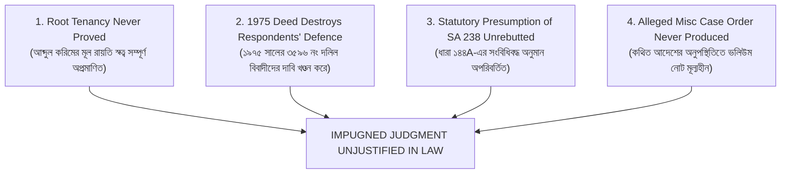

# জেলা জজ আদালত, টাঙ্গাইল
## আপীল মামলা নং ৩৮/২০২৬
### বাটোয়ারা মামলা নং ৬৬/২০১৬, সখিপুর সিভিল জজ আদালত হইতে উদ্ভূত
**হাতেম আলী ও অন্যান্য (আপীল্যান্ট/বাদী) বনাম আলহাজ উদ্দিন ও অন্যান্য (রেসপন্ডেন্ট/বিবাদী)**

**আপীল্যান্টপক্ষের পূর্ণাঙ্গ লিখিত যুক্তিতর্ক (Version 65 — Measured Appellate Brief)**

**তারিখ:** ৩০ জুলাই ২০২৬ | **আদালত:** জেলা জজ আদালত, টাঙ্গাইল

---

# EXECUTIVE SUMMARY (প্রারম্ভিক নীতি-সারসংক্ষেপ)

## Why Trial Court Must Be Reversed (কেন নিম্ন আদালতের রায় আইনি বিচারে টেকসই নয়)

মহামান্য আদালত, নিম্ন আদালতের ০৫-০৪-২০২৬ তারিখের বিচারিক রায় ও ডিক্রি আইন ও সাক্ষ্যের বিচারে স্থায়িত্ব পাওয়ার যোগ্য নয়। সংক্ষেপে **মূল ৪টি আইনগত স্তম্ভ (Core Pillars)** এবং **৭টি সুনির্দিষ্ট কারণ** নিম্নে উপস্থাপন করা হইল:

### 🏛️ দ্য ৪ কোর পিলার্স (The 4 Core Pillars of Appeal)

> **The impugned judgment cannot be sustained in law because —**

1. **Root tenancy never proved:** বিজ্ঞ ট্রায়াল কোর্ট বিবাদীদের পূর্বসূরি আব্দুল করিমকে মূল প্রজা হিসেবে অনুমান করিয়া লইয়াছেন — অথচ বিবাদীরা কোনো পাট্টা, কবুলিয়ত, সিএস খতিয়ান বা নবাব এস্টেটের চিফ ম্যানেজারের অনুমোদন উপস্থাপন করিতে পারেন নাই।
2. **Respondents' own 1975 deed contradicts their defence:** বিবাদীরা দাবি করেন ১৯৬৯ সালের কথিত সংশোধনের পর SA ২৩৮ খতিয়ানে জমি ছিল মাত্র ১টি দাগে (১২৫৯ দাগ), অথচ তাহাদের নিজেদের রেজিস্ট্রিকৃত ৩৫৯৬/১৯৭৫ নং দলিলে (Exhibit Kha-1) উক্ত খতিয়ানে ৬টি দাগের বিবরণ রহিয়াছে — যা তাহাদের রক্ষণাত্মক দাবির ভিত্তি দুর্বল করিয়া দেয়।
3. **Statutory presumption of SA 238 remains unrebutted:** রাষ্ট্র কর্তৃক সরেজমিনে তদন্তের পর প্রস্তুতকৃত এবং জেলা রেকর্ড রুমে অপরিবর্তিত SA ২৩৮ খতিয়ান (আব্দুল আলী ১৬ আনা প্রজা) SAT Act, 1950-এর Section 144A অনুযায়ী সংবিধিবদ্ধ নির্ভুলতার অনুমান বহন করে, যা নির্ভরযোগ্য সাক্ষ্য ছাড়া খণ্ডন করা যায় না।
4. **Alleged Misc Case order was never produced:** বিবাদীদের দাবিকৃত ১৯৬৯ সালের ১১৮১ নং Misc Case-এর কোনো আদেশনামা, রায় বা সার্টিফাইড কপি আদালতে উপস্থিত নাই। মূল আদেশের অনুপস্থিতিতে AC Land ভলিউম নোটের স্বাধীন অস্তিত্ব থাকিতে পারে না।
5. **AC Land note cannot override DC Record Room:** সখিপুর AC Land অফিসে ভিন্ন কালিতে লেখা ব্যাখ্যাহীন ভলিউম নোট জেলা প্রশাসকের সেন্ট্রাল রেকর্ড রুমের সংবিধিবদ্ধ রেকর্ডকে বাতিল করিতে পারে না। রাজস্ব কর্মকর্তার স্বত্ব খর্ব বা পরিবর্তন করার এখতিয়ার নাই।
6. **Illegal shifting of burden of proof:** বাদী সইমোহরি খতিয়ান দাখিল করিয়া প্রমাণের প্রাথমিক দায় (Initial Burden) নিষ্পত্তির পর, বিজ্ঞ ট্রায়াল কোর্ট অন্যায়ভাবে বাদীর উপর দায়িত্ব চাপাইয়াছেন বিবাদীদের অপ্রমাণিত দাবি খণ্ডন করার (Negative Proof Error), যা Evidence Act-এর Section 103-এর পরিপন্থী।
7. **The consequential claim fails:** যখন বিবাদীদের কথিত স্বত্বের মূল (Root Tenancy) এবং কথিত সংশোধন আদেশ উভয়ই প্রমাণের অভাবে অকার্যকর হয়, তখন নিম্ন আদালতের রায় আইনি সমর্থন হারিয়ে বাতিলযোগ্য হইয়া পড়ে।

---

# CHAPTER 1: The Fatal Error of the Trial Court — Unproved Root Tenancy
### *(বিজ্ঞ ট্রায়াল কোর্টের মূল ভুল — প্রাক-SA স্বত্বের অনুপস্থিতি)*

## ১.১ Trial Court Held (ট্রায়াল কোর্টের সিদ্ধান্ত)
> *"বিজ্ঞ ট্রায়াল কোর্ট বিবাদীদের এই দাবি গ্রহণযোগ্য বিবেচনা করিয়াছেন যে বিবাদীদের পূর্বসূরি আব্দুল করিম ১৯৩৪ সালে ঢাকা নবাব এস্টেট হইতে পত্তন লাভ করিয়া নালিশী সম্পত্তিতে প্রজা স্বত্ব অর্জন করিয়াছিলেন এবং তাহার মৃত্যুর পর আব্দুল আলী ও সোনাভানু উভয়েই ওয়ারিশসূত্রে প্রজা হন।"*

## ১.২ Why This is Legally Wrong (কেন এই সিদ্ধান্ত আইনগতভাবে অগ্রহণযোগ্য)
**Before treating SA Record as incorrect, who proved Abdul Karim was ever the raiyat?**
বিজ্ঞ ট্রায়াল কোর্ট প্রমাণের প্রাথমিক ভিত্তি (Root Tenancy) না থাকা সত্ত্বেও বিবাদীদের প্রজা স্বত্ব অনুমান করিয়া লইয়াছেন। বিবাদীরা নালিশী জমিতে আব্দুল করিমের প্রজা স্বত্বের প্রাথমিক দলিল উপস্থাপন করিতে ব্যর্থ হইয়াছেন:

1. **কোনো রেজিস্ট্রিকৃত পাট্টা (Patta) বা কবুলিয়ত (Kabuliat) নাই:** Registration Act, 1908-এর ধারা ১৭/৪৯ অনুযায়ী ১ বছরের অধিক মেয়াদের স্থাবর সম্পত্তির বন্দোবস্ত লিখিত ও রেজিস্ট্রিকৃত হওয়া আবশ্যিক।
2. **কোনো বৈধ মৌখিক বন্দোবস্তের (Oral Settlement) প্রমাণ নাই:** যদি দাবি করা হয় যে ইহা মৌখিক বন্দোবস্ত ছিল, তবুও আইনসিদ্ধ বন্দোবস্ত অনুসরণে সুনির্দিষ্ট দখলের কোনো প্রত্যক্ষ প্রমাণ বিবাদীরা দাখিল করিতে পারেন নাই (*No evidence of possession pursuant to any lawful settlement has also been proved*)।
3. **CS ২ নং খতিয়ানে কোনো প্রজা নাম নাই:** CS খতিয়ানে জমিটি ঢাকা নবাব এস্টেটের "খাস জমি" হিসেবে নথিভুক্ত। সেখানে আব্দুল করিমের কোনো অধিকারের উল্লেখ নাই।
4. **Chief Manager-এর অনুমোদনের অনুপস্থিতি:** ঢাকা নবাব এস্টেট Court of Wards-এর অধীন ছিল। Chief Manager-এর লিখিত অনুমোদন ও স্বাক্ষর ছাড়া কোনো নায়েব বা তহশিলদারের রসিদ বা কাগজ আইনগতভাবে প্রজা স্বত্ব সৃষ্টি করিতে পারে না।
5. **খাজনার রসিদ স্বত্ব সৃষ্টি করে না:** বিবাদীদের দাখিলকৃত রসিদ কেবল সাময়িক অর্থ প্রাপ্তির সূচক, ইহা প্রজা স্বত্ব (Raiyati Title) সৃষ্টির আইনি প্রমাণ নহে।

## ১.৩ Clarification on Plaintiff Abdul Ali's Title (আব্দুল আলীর স্বত্বের অকাট্য ভিত্তি)
> **Clarification:** *"Abdul Ali's title is not claimed through Abdul Karim's alleged settlement. His status derives directly from the finally published SA Record (reflecting state recognition and continuous physical possession) and subsequent registered transactions."*

## ১.৪ Applicable Law & Precedents (প্রযোজ্য আইন ও নজির)
- **SAT Act, 1950 (Section 86):** Any alleged unregistered settlement, if not recognized after State Acquisition, cannot prevail against the finally published Record of Rights.
- **Md. Shajahan Bhuiyan vs. Md. Nurul Alam, 4 SCOB [2015] HCD 52:**
  > *"Unrecognized pre-SA unregistered pattan cannot survive state acquisition to defeat a recorded tenancy."*
- **Harun-al-Rashid Mollah vs. Bangladesh, 12 BLC (AD) 79:**
  > *"Settlement or rent receipts of Court of Wards / Dhaka Nawab Estate without the written approval of the Chief Manager confer no lawful title."*
- **Noor Mohammad Khan vs. Government, 42 DLR (HD) 434:**
  > *"Salami receipts issued without Chief Manager's approval cannot create tenancy rights over Court of Wards lands."*

## ১.৫ Conclusion (উপসংহার)
বিজ্ঞ ট্রায়াল কোর্ট বিবাদীদের অপ্রমাণিত ও আইনগতভাবে অকার্যকর প্রাক-SA দাবিকে গ্রহণ করিয়া মামলার শুরুতেই উপাদানগত আইনি ভুল (Material Error of Law) করিয়াছেন।

---

# CHAPTER 2: State Recognition & Presumption of Correctness
### *(রাষ্ট্রীয় স্বীকৃতি এবং সংবিধিবদ্ধ নির্ভুলতার অনুমান)*

## ২.১ Trial Court Held (ট্রায়াল কোর্টের সিদ্ধান্ত)
> *"বিজ্ঞ ট্রায়াল কোর্ট ধরে নিয়েছেন যে, SA ২৩৮ নং খতিয়ান প্রস্তুতকালে ভুলক্রমে কেবল আব্দুল আলীর নাম রেকর্ড করা হইয়াছিল এবং বাদীর দায়িত্ব ছিল বিবাদীদের দাবির বিপরীতে খতিয়ানের নির্ভুলতা পুনর্বার প্রমাণ করা।"*

## ২.২ Why This is Legally Wrong (কেন এই সিদ্ধান্ত আইনগতভাবে অগ্রহণযোগ্য)
ইহা প্রমাণের প্রথাগত নিয়মাবলীর সরাসরি বিপরীত (Illegal Shifting of Burden of Proof)।
1. রাষ্ট্রীয় জরিপ কর্তৃপক্ষ সরেজমিনে তদন্তের পর আব্দুল আলীকে প্রত্যক্ষ দখলদার ও প্রজা হিসেবে স্বীকৃতি দিয়া SA ২৩৮ নং খতিয়ান প্রস্তুত ও প্রকাশ করে।
2. SAT Act, 1950-এর Section 144A অনুযায়ী এই অবশেষে প্রকাশিত খতিয়ানের আইনি নির্ভুলতার অনুমান (Statutory Presumption of Correctness) সংবিধিবদ্ধ।
3. বাদী খতিয়ান (প্রদর্শনী-৪) উপস্থাপনের মাধ্যমে Initial Burden সম্পূর্ণ সম্পন্ন করিয়াছেন। প্রমাণের দায়িত্ব সম্পূর্ণ বিবাদীদের উপর স্থানান্তরিত হইয়াছিল।

## ২.৩ Applicable Law (প্রযোজ্য আইন)
- **SAT Act, 1950 (Section 144A):** খতিয়ান চূড়ান্তভাবে প্রকাশিত হইবার পর উহা সংবিধিবদ্ধ নির্ভুলতার অনুমান লাভ করে।
- **Evidence Act, 1872 (Section 103):** যিনি কোনো নথির ভুল বা সংশোধন দাবি করেন, প্রমাণের দায়িত্ব সম্পূর্ণ তাঁহার উপর বর্তায়।

## ২.৪ Applicable Precedent (প্রযোজ্য নজির)
- **Government of Bangladesh vs. AKM Abdul Hye, 56 DLR (AD) 53:**
  > *"SA records of rights carry statutory presumption of correctness under Section 144A of the SAT Act until rebutted by clear and reliable evidence."*
- **Dayal Chandra Mondal vs. Asst. Custodian, 50 DLR 186:**
  > *"A record of rights finally published under Section 144A has a presumption of correctness that continues till rebutted by cogent evidence."*
- **Sekandar Ali vs. Md. Ismail, 35 DLR (AD) 230:**
  > *"The onus lies heavily on the party who asserts that the record-of-rights entry is incorrect to prove it by positive evidence."*
- **Nuruddin Ahmed vs. Md. Jaman, 45 DLR (AD) 124:**
  > *"A trial court errs in law when it requires the plaintiff to disprove every counter-assertion instead of holding the challenger to their onus."*

## ২.৫ Conclusion (উপসংহার)
ট্রায়াল কোর্ট Evidence Act Section 103 এবং SAT Act Section 144A-এর সরাসরি ব্যত্যয় ঘটাইয়া বাদীর উপর নেতিবাচক প্রমাণের দায়িত্ব চাপাইয়াছেন, যা সংশোধনযোগ্য।

---

# CHAPTER 3: Collapse of the Correction Theory — Alleged Misc Case 1181/1969
### *(কথিত ১৯৬৯ সালের মিস মোকদ্দমা ও সংশোধন দাবির ভিত্তিহীনতা)*

## ৩.১ Trial Court Held (ট্রায়াল কোর্টের সিদ্ধান্ত)
> *"বিজ্ঞ ট্রায়াল কোর্ট বিবাদীদের এই দাবির উপর নির্ভর করিয়াছেন যে, ১৯৬৯ সালের ১১৮১ নং Misc Case-এর আদেশের মাধ্যমে SA ২৩৮ খতিয়ানে সোনাভানুর নাম অন্তর্ভুক্ত হইয়াছে।"*

## ৩.২ Why This is Legally Wrong (কেন এই সিদ্ধান্ত আইনগতভাবে অগ্রহণযোগ্য)
ইহা একটি সম্পূর্ণ অপ্রমাণিত প্রক্রিয়াগত দাবির উপর বিচারিক নির্ভরতা।
1. **কোনো সার্টিফাইড কপি দাখিল করা হয় নাই:** বিবাদীরা উক্ত কথিত Misc Case-এর কোনো Judgment, Decree, Order Sheet বা Certified Copy দাখিল করিতে পারেন নাই।
2. **Misc Case-এ স্বত্ব সিদ্ধান্ত অসম্ভব:** Misc Case-এ কেবল প্রক্রিয়াগত বা প্রশাসনিক Order হয় (CPC s.2(14)), স্বত্বের Decree হয় না (CPC s.2(2))। স্বত্ব ঘোষণা কেবল নিয়মিত দেওয়ানি স্যুটেই সম্ভব।
3. **The Principle of Evidentiary Reasoning:**
   > *"As a settled principle of evidentiary reasoning, the alleged consequential entry cannot survive when the foundational order itself remains unproved."*

## ৩.৩ Applicable Law & Precedents (প্রযোজ্য আইন ও নজির)
- **Code of Civil Procedure, 1908 (Section 2(2) vs 2(14)):** Misc Case-এ স্বত্বের ডিক্রি প্রদান সম্ভব নহে।
- **Evidence Act, 1872 (Section 114(g)):** প্রাতিষ্ঠানিক নথি (Order Sheet-এর Certified Copy) গোপন বা দাখিল না করার কারণে প্রতিকূল অনুমান (Adverse Inference) গ্রহণ প্রযোজ্য।
- **27 BLD (HD) 544:**
  > *"Question of title cannot be decided in a miscellaneous proceeding; declaration of title requires a properly constituted civil suit."*

## ৩.৪ Conclusion (উপসংহার)
মূল আদেশ (Parent Order) অপ্রমাণিত থাকায় কথিত সংশোধনের দাবি আইনগতভাবে সম্পূর্ণ ভিত্তিহীন হইয়া পড়ে।

---

# CHAPTER 4: AC Land Volume Note Has No Legal Force
### *(সখিপুর AC Land ভলিউম নোটের আইনি সীমাবদ্ধতা ও এখতিয়ারহীনতা)*

## ৪.১ Trial Court Held (ট্রায়াল কোর্টের সিদ্ধান্ত)
> *"বিজ্ঞ ট্রায়াল কোর্ট সখিপুর AC Land কার্যালয়ের ভলিউমে লিখিত মার্জিন নোটের ভিত্তিতে বিবাদীদের দাবিকৃত সংশোধন গ্রহণ করিয়াছেন।"*

## ৪.২ Why This is Legally Wrong (কেন এই সিদ্ধান্ত আইনগতভাবে অগ্রহণযোগ্য)
১. **রাজস্ব কর্মকর্তার এখতিয়ারের সীমা (Jurisdictional Limits):** AC Land বা রাজস্ব কর্মকর্তা দেওয়ানি আদালত নন। Mutation-এর প্রশাসনিক প্রক্রিয়ায় কারো স্বীকৃত স্বত্ব কর্তন করিয়া বা নতুন অংশীদার যুক্ত করিয়া স্বত্ব নির্ধারণের (Title Adjudication) কোনো এখতিয়ার রাজস্ব কর্মকর্তার নাই।
2. **লেখক চিহ্নিতকরণে ব্যর্থতা:** DW-4 (AC Land প্রতিনিধি) জবানবন্দিতে স্বীকার করেন যে ভলিউম নোটটি ভিন্ন কালিতে এবং ভিন্ন হাতের লেখায় যুক্ত। *DW-4 could neither identify the author of the margin entry nor produce the original correction proceeding or parent file.*
3. **সাতটি আবশ্যিক ধাপ অনুপস্থিত:** মিউটেশন আবেদন, ফাইল, নোটিশ, তদন্ত প্রতিবেদন, লিখিত আদেশ, জেলা রেকর্ড রুমে সংশোধন ও Register of Alterations Entry — এর কোনোটিই ঘটে নাই।
4. **DC Record Room-এর ৫০ বছরের অপরিবর্তিত স্থিতি:** জেলা প্রশাসকের সেন্ট্রাল রেকর্ড রুমের মূল খতিয়ানে আজও কোনো পরিবর্তন হয় নাই।

## ৪.৩ Applicable Law & Precedents (প্রযোজ্য আইন ও নজির)
- **Mrigangka Mohan Dhali vs. Chitta Ranjan Mondol, 18 SCOB [2023] AD 20:**
  > *"An administrative entry or procured mutation note cannot override an established title or statutory presumption attached to a finally published record."*
- **Aslam vs. Salauddin, 18 BLC (HD) 235:**
  > *"A Revenue Officer acting in a mutation case under Section 143 is not a Court; mutation entries do not create or extinguish title."*
- **29 BLC (HD) 160:**
  > *"If in correcting an error, the title of the recorded raiyat is affected, the Revenue Officer has no jurisdiction to touch the record."*
- **Shahera Khatun vs. State, 53 DLR 19:**
  > *"A volume note carries no statutory presumption of correctness without the underlying parent order."*
- **Fazlur Rahman vs. Bangladesh, 1 BLT (HD) 18:**
  > *"Khatian changes made in separate ink or handwriting without a parent judicial order sheet are invalid and legally ineffective."*

## ৪.৪ Conclusion (উপসংহার)
অভিভাবকহীন কালির নোট দিয়ে জেলা রেকর্ড রুমের মূল সংবিধিবদ্ধ রেকর্ড বাতিল গণ্য করার সিদ্ধান্ত আইনগতভাবে অস্থিতিশীল।

---

# CHAPTER 5: Respondents' Defence Defeats Itself — Internal Contradictions
### *(বিবাদীদের নিজেদের অবস্থানের অভ্যন্তরীণ অসঙ্গতি)*

## ৫.১ Trial Court Held (ট্রায়াল কোর্টের সিদ্ধান্ত)
> *"বিজ্ঞ ট্রায়াল কোর্ট বিবাদীদের উপস্থাপিত বক্তব্য ও নথিপত্রকে নির্ভরযোগ্য বিবেচনা করিয়াছেন।"*

## ৫.২ Why This is Legally Wrong (কেন এই সিদ্ধান্ত আইনগতভাবে অগ্রহণযোগ্য)
বিবাদীদের নিজেদের কাগজপত্র ও সাক্ষ্যের বিশ্লেষণে ৫টি অখণ্ডনীয় অভ্যন্তরীণ অসঙ্গতি প্রকাশ পায়:

### ১. বিবাদীদের নিজের ১৯৭৫ সালের রেজিস্ট্রিকৃত দলিলের স্বীকারোক্তি (Deed 3596/1975):
- **বিবাদীদের দাবি:** ১৯৬৯ সালের আদেশের পর SA ২৩৮ খতিয়ানে জমি ছিল **মাত্র ১টি দাগে (১২৫৯ দাগ)**।
- **বিবাদীদের নিজেদের ৩৫৯৬/১৯৭৫ নং রেজিস্ট্রিকৃত দলিল (Exhibit Kha-1):** উক্ত দলিলে বিবাদীরা স্পষ্ট বর্ণনা করিয়াছেন যে SA ২৩৮ খতিয়ানের অধীনে ১টি নহে, **৬টি দাগ** রহিয়াছে।
- **আইনি প্রভাব:** নিজেদের দলিলের এই স্ববিরোধী বর্ণনা প্রমাণ করে যে বিবাদীরা নিজেরাও ১৯৬৯ সালের কথিত সংশোধনকে সত্য বলিয়া গণ্য করতেন না।

### ২. বিবাদীদের নিজ সাক্ষী DW-4-এর বক্তব্য:
- DW-4 স্বীকার করেন নোটটি ভিন্ন কালিতে লিখিত এবং তিনি উহার মূল কারণ বা ফাইল সরবরাহ করিতে পারেন নাই।
- DW-4 মূল রেকর্ডভুক্ত প্রজা "আব্দুল আলী"-র পরিবর্তে বারবার "আব্দুল আলীম" উচ্চারণ করেন।

### ৩. সোনাভানুর অন্য বোনদের বাদ পড়া:
- বিবাদীরা দাবি করে আব্দুল করিমের ওয়ারিশ সূত্রে সোনাভানুর নাম ঢুকিয়াছে। কিন্তু আব্দুল করিমের অন্য দুই কন্যা (বেলুয়া ও কমলা)-র নাম কেন বাদ পড়িল, তাহার কোনো সুসংগত ব্যাখ্যা নাই।

### ৪. গাণিতিক অসম্ভাব্যতা (Arithmetic Discrepancy):
- বিবাদীদের দাবি করা পরিমাণ: ৩৪৯ শতাংশ।
- সরকারি খাস জমির পরিমাণ: ১৩৭ শতাংশ।
- মোট যোগফল: **৪৮৬ শতাংশ** (অথবা দাগের মোট আয়তন ৪৭৭ শতাংশ, যা সিএস/এসএ ২৩৮ দাগ তফসিল ও সরেজমিন রেকর্ড দ্বারা সমর্থিত; ৯ শতাংশ অতিরিক্ত জমি বাস্তবতার পরিপন্থী)।

### ৫. সেন্ট্রাল রেকর্ড রুমের অপরিবর্তিত স্থিতি:
- জেলা প্রশাসকের সেন্ট্রাল রেকর্ড রুমে আজও SA ২৩৮ খতিয়ান আব্দুল আলীর নামে বহাল।

## ৫.৩ Applicable Law & Principles (প্রযোজ্য আইনি নীতি)
- **Evidence Act, 1872 (Sections 17, 18 & 21):** নিজের দলিলের বিবরণ স্বীকৃত তথ্য (Admission) হিসেবে গণ্য।
- **Doctrine of Approbate and Reprobate:** *"A party cannot be allowed to approbate and reprobate — assert one dag for litigation and execute registered deeds for six dags under the same khatian."*

## ৫.৪ Conclusion (উপসংহার)
বিবাদীদের আত্মবিরোধী বক্তব্য তাহাদের প্রতিরক্ষার ভিতকে দুর্বল করে, যা ট্রায়াল কোর্ট বিবেচনা করিতে ব্যর্থ হইয়াছেন।

---

# CHAPTER 6: Partition Suit Was Fully Maintainable
### *(বাটোয়ারা মামলার রক্ষণীয়তা, খাস জমি ও সরকারের পক্ষভুক্তি)*

## ৬.১ Trial Court Held (ট্রায়াল কোর্টের সিদ্ধান্ত)
> *"বিজ্ঞ ট্রায়াল কোর্ট সিদ্ধান্ত দিয়াছেন যে, ১২৫৯ দাগের সমুদয় জমি বাটোয়ারায় না আনায় মামলাটি আংশিক বাটোয়ারার দোষে দুষ্ট এবং সরকারকে পক্ষ না করায় মামলাটি খারিজযোগ্য।"*

## ৬.২ Why This is Legally Wrong (কেন এই সিদ্ধান্ত আইনগতভাবে অগ্রহণযোগ্য)
১. **Incidental Title Adjudication:** বাটোয়ারা আদালতের সম্পূর্ণ এখতিয়ার রহিয়াছে মামলার ভেতরেই অনুষঙ্গিক স্বত্ব (Incidental Title) পরীক্ষা করার।
২. **Hotchpot Rule-এর সীমারেখা:** SA ২৩৮ একটি পৃথক ব্যক্তিমালিকানাধীন প্রজা খতিয়ান। *The alleged Government land is neither claimed by the plaintiffs nor sought to be partitioned.* পৃথক খতিয়ানের জমি বাদ দিলে আংশিক বাটোয়ারার দোষ ঘটে না।
৩. **Government-এর Non-joinder:** সহ-শরীকদের ব্যক্তিমালিকানাধীন বাটোয়ারা মামলায় সরকার আবশ্যকীয় পক্ষ (Necessary Party) নহে।

## ৬.৩ Applicable Law & Precedents (প্রযোজ্য আইন ও নজির)
- **Safaruddin vs. Fazlul Huq, 49 DLR (AD) 15:**
  > *"The Government is not a necessary party in a private partition suit between co-sharers where no relief is sought against the State."*
- **Shahjahan Akon vs. Murshida Khanam, 27 BLD (HD) 229:**
  > *"Separate khatians create separate tenancies; no hotchpot defect arises from leaving out adjacent government plots or land under different tenancies."*
- **Syed Nurul Huda vs. Govt. of Bangladesh, 8 SCOB (2016) HCD 1:**
  > *"A suit for partition cannot fail merely for non-joinder of parties unless the party omitted is a necessary party."*

## ৬.৪ Conclusion (উপসংহার)
Hotchpot ও Non-joinder সংক্রান্ত ট্রায়াল কোর্টের ভিত্তি বাতিলযোগ্য।

---

# CHAPTER 7: Focused Bench Questions & Precise Answers
### *(মৌখিক শুনানির জন্য ১০টি অগ্রাধিকারপ্রাপ্ত প্রশ্ন ও সুনির্দিষ্ট জবাব)*

**Q1: বিবাদীরা Misc Case 1181/1969-এর সার্টিফাইড কপি কেন উপস্থাপন করতে পারেন নাই?**
> **Answer:** *"My Lord, বিবাদীরা Misc Case-এর সার্টিফাইড কপি দিতে পারেন নাই কারণ বাস্তবে কোনো বিচারিক আদেশের অস্তিত্বই ছিল না। Evidence Act Section 114(g) অনুযায়ী প্রাতিষ্ঠানিক নথি দাখিল না করার কারণে প্রতিকূল অনুমান (Adverse Inference) গ্রহণ প্রযোজ্য।"*

**Q2: AC Land ভলিউম নোটের আইনি গুরুত্ব কতটুকু?**
> **Answer:** *"My Lord, 53 DLR 19 এবং 1 BLT 18 অনুযায়ী Parent Order ছাড়া Volume Note-এর কোনো স্বাধীন আইনি অস্তিত্ব নাই। foundational order না থাকলে consequential note বাতিল হইতে বাধ্য।"*

**Q3: রাজস্ব কর্মকর্তা (AC Land) কি মিউটেশনে স্বত্ব পরিবর্তন করতে পারেন?**
> **Answer:** *"My Lord, 18 BLC 235 এবং 29 BLC 160 অনুযায়ী AC Land আদালত নন। নামজারির প্রশাসনিক এখতিয়ারে কারো প্রজা স্বত্ব কর্তন বা নতুন অংশীদার যুক্ত করার ক্ষমতা তাঁহার নাই।"*

**Q4: প্রাক-SA যুগের ১৩৩৪ বঙ্গাব্দের পত্তনের আইনি স্থিতি কি?**
> **Answer:** *"My Lord, 4 SCOB [2015] HCD 52 অনুযায়ী SAT Act-এর ধারা ৮৬ মূলে প্রাক-SA যুগের যেকোনো অনিবন্ধিত পত্তন বা স্বত্ব খতিয়ানের বিপরীতে কার্যকর থাকে না। অধিকন্তু CS ২ খতিয়ানে জমিটি নবাব এস্টেটের খাস জমি ছিল।"*

**Q5: বিবাদীদের ১৯৭৫ সালের দলিল (Deed 3596/1975) কীভাবে তাহাদের দাবি খণ্ডন করে?**
> **Answer:** *"My Lord, বিবাদীরা দাবি করে ১৯৬৯ সংশোধনে SA ২৩৮-এ দাগ মাত্র ১টি। অথচ ১৯৭৫ সালে তাহাদের নিজ দলিলেই ৬টি দাগের বিবরণ রহিয়াছে (Exhibit Kha-1)। বিবাদীরা নিজেরাও উক্ত কথিত সংশোধন সত্য গণ্য করতেন না।"*

**Q6: সরকারি জমি বাদ পড়ায় কি আংশিক বাটোয়ারার (Hotchpot) দোষ হইয়াছে?**
> **Answer:** *"My Lord, না। 27 BLD 229 অনুযায়ী পৃথক খতিয়ানের জমি বা সরকারের জমি ব্যক্তিমালিকানাধীন বাটোয়ারায় আনা বাধ্যতামূলক নয়। The alleged Government land is neither claimed by the plaintiffs nor sought to be partitioned."*

**Q7: সরকারকে পক্ষ না করায় কি মামলা খারিজ হইতে পারে?**
> **Answer:** *"My Lord, আপীল বিভাগের 49 DLR (AD) 15 (Safaruddin Case) অনুযায়ী সহ-শরীকদের প্রসংগে বাটোয়ারা মামলায় সরকার কোনো আবশ্যকীয় পক্ষ (Necessary Party) নয়।"*

**Q8: DW-4 জেরায় কি স্বীকার করিয়াছেন?**
> **Answer:** *"My Lord, DW-4 স্বীকার করিয়াছেন ভলিউম নোটটি ভিন্ন কালিতে লিখিত এবং তিনি মূল আদেশের ফাইল দাখিল করিতে পারেন নাই।"*

**Q9: সোনাভানুর বোনদের নাম বাদ পড়া কেন তাৎপর্যপূর্ণ?**
> **Answer:** *"My Lord, আব্দুল করিমের মৃত্যুর পর কেবল সোনাভানুর নাম ঢোকা এবং বেলুয়া ও কমলার নাম বাদ পড়া ইহা প্রথাগত উত্তরাধিকার সংশোধনের দাবিকে দুর্বল করে।"*

**Q10: জেলা প্রশাসকের রেকর্ড রুমের অপরিবর্তিত খতিয়ানের গুরুত্ব কি?**
> **Answer:** *"My Lord, জেলা প্রশাসকের কেন্দ্রীয় রেকর্ড রুমই Statutory ROR-এর একমাত্র সংবিধিবদ্ধ অভিভাবক। ৫০ বছর সেখানে মূল খতিয়ান অপরিবর্তিত থাকা প্রমাণ করে স্থানীয় ভলিউমের নোট আইনি সমর্থনহীন।"*

---

# CHAPTER 8: Issue-Wise Authorities Index
### *(সুনির্দিষ্ট ইস্যুভিত্তিক সুপ্রিম কোর্টের নজিরের বিন্যাস)*

### ISSUE 1: Pre-SA Tenancy & Root Title Authorities
- **4 SCOB [2015] HCD 52** (*Md. Shajahan Bhuiyan*): SAT Act s.86-এ প্রাক-SA অনিবন্ধিত পত্তন খতিয়ানের বিপরীতে অকার্যকর।
- **12 BLC (AD) 79** (*Harun-al-Rashid Mollah*): Chief Manager approval ছাড়া নবাব এস্টেটের পত্তন রসিদ প্রজা স্বত্ব সৃষ্টি করে না।
- **42 DLR (HD) 434** (*Noor Mohammad Khan*): আমলনামা/সালামি রশিদ স্বত্ব সৃষ্টি করে না।

### ISSUE 2: Statutory Presumption & Burden of Proof Authorities
- **56 DLR (AD) 53** (*Govt vs. AKM Abdul Hye*): SA খতিয়ানের Presumption সংবিধিবদ্ধ।
- **50 DLR (HD) 186** (*Dayal Chandra Mondal*): Section 144A Presumption প্রমাণ ছাড়া নিরবচ্ছিন্ন থাকে।
- **35 DLR (AD) 230** (*Sekandar Ali vs. Md. Ismail*): খতিয়ানের ভুল প্রমাণের ভারী দায়িত্ব চ্যালেঞ্জকারীর উপর।
- **45 DLR (AD) 124** (*Nuruddin Ahmed*): বাদীর উপর অন্যায়ভাবে Negative Proof চাপানো বেআইনি।

### ISSUE 3: Misc Case & Void Order Authorities
- **27 BLD (HD) 544**: Misc Case-এর সংক্ষিপ্ত প্রশাসনিক প্রক্রিয়ায় Title Adjudication সম্ভব নহে।
- **Evidence Act Section 114(g)**: প্রাতিষ্ঠানিক নথি (Order Sheet) দাখিল না করার বিরূপ প্রতিক্রিয়া।

### ISSUE 4: Mutation & Volume Note Jurisdiction Authorities
- **18 SCOB [2023] AD 20** (*Mrigangka Mohan Dhali*): Administrative mutation দ্বারা প্রতিষ্ঠিত Title খর্ব হয় না।
- **18 BLC (HD) 235** (*Aslam vs. Salauddin*): AC Land আদালত নন; Mutation দ্বারা Title সৃষ্টি/বিলোপ হয় না।
- **29 BLC (HD) 160**: স্বত্ব প্রভাবিত হলে AC Land-এর খতিয়ান সংশোধনের এখতিয়ার নাই।
- **53 DLR (HD) 19** (*Shahera Khatun*): Parent Order ছাড়া Volume Note-এর Presumption নাই।
- **1 BLT (HD) 18** (*Fazlur Rahman*): ভিন্ন কালির ব্যাখ্যাহীন নোট আইনি কার্যকারিতাহীন।

### ISSUE 5: Admissions & Estoppel Authorities
- **Evidence Act Sections 17, 18, 21**: নিজের দলিলের স্বীকারোক্তি (Deed 3596/1975) পক্ষকে আবদ্ধ করে।
- **Doctrine of Approbate and Reprobate**: একইসাথে স্ববিরোধী দাবি করার বৈপরীত্য।

### ISSUE 6: Partition Technicalities & Necessary Party Authorities
- **49 DLR (AD) 15** (*Safaruddin vs. Fazlul Huq*): ব্যক্তিমালিকানাধীন বাটোয়ারায় সরকার Necessary Party নয়।
- **27 BLD (HD) 229** (*Shahjahan Akon*): পৃথক খতিয়ান বা সরকারি জমি বাদ দিলে Hotchpot দোষ ঘটে না।
- **8 SCOB (2016) HCD 1** (*Syed Nurul Huda*): Necessary Party ছাড়া মামলা খারিজ হয় না।

---

# MASTER CLOSING SUBMISSIONS (সমাপনী বিচারিক আবেদন)

> **"The respondents have failed to prove the foundation of their defence. Once the alleged correction order disappears, every consequential claim founded upon it also disappears. Consequently, the statutory presumption attached to the finally published SA Record remains wholly unrebutted. The impugned judgment, therefore, cannot be sustained in law and deserves to be set aside.**
> 
> **The appeal therefore deserves to be allowed with costs, and the judgment and decree dated 05-04-2026 passed by the Trial Court should be set aside."**

---

**আপীল্যান্টগণের পক্ষে বিজ্ঞ কৌসুলি | জেলা জজ আদালত, টাঙ্গাইল | আপীল মামলা নং ৩৮/২০২৬**
