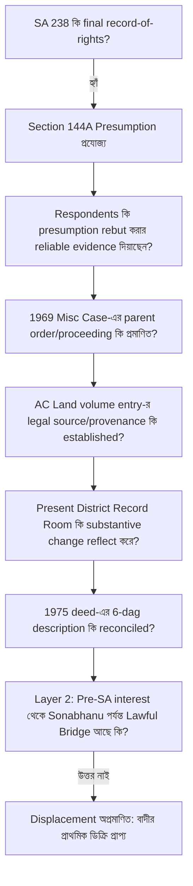

# জেলা জজ আদালত, টাঙ্গাইল

## আপীল মামলা নং ৩৮/২০২৬

### বাটোয়ারা মামলা নং ৬৬/২০১৬, সখিপুর সিভিল জজ আদালত হইতে উদ্ভূত

**হাতেম আলী ও অন্যান্য**
— আপীল্যান্ট/বাদী

**বনাম**

**আলহাজ উদ্দিন ও অন্যান্য**
— রেসপন্ডেন্ট/বিবাদী

# আপীল্যান্টপক্ষের পূর্ণাঙ্গ লিখিত যুক্তিতর্ক

## **Version 88 — Independent, Measured & Evidence-Centred Appellate Brief**

**তারিখ:** ১৫ আগস্ট ২০২৬  
**আদালত:** জেলা জজ আদালত, টাঙ্গাইল  

---

# প্রারম্ভিক নিবেদন ও এখতিয়ারগত স্পষ্টীকরণ (Opening Address & Jurisdictional Clarification)

**মহামান্য আদালত,**

সখিপুর সিভিল জজ আদালতের বাটোয়ারা মামলা নং ৬৬/২০১৬-এর ০৫-০৪-২০২৬ তারিখের খারিজ রায় ও ০৯-০৪-২০২৬ তারিখের ডিক্রির বিরুদ্ধে আপীল্যান্ট বাদীপক্ষের এই আপীল।

এই আপীলের নিষ্পত্তির জন্য সমগ্র জমিদারি ইতিহাস, ১৯৩৪ সালের কথিত পত্তন এবং পরবর্তী পারিবারিক বংশতালিকার প্রতিটি অস্পষ্টতা একসঙ্গে পুনর্গঠন করা আবশ্যক নহে। এই আপীলে কালানুক্রমিক ইতিহাসের চেয়ে সাক্ষ্যের আইনগত ক্রম (evidentiary hierarchy) অধিক গুরুত্বপূর্ণ।

রাষ্ট্রের অধিগ্রহণ-পরবর্তী জরিপে প্রস্তুত ও চূড়ান্তভাবে প্রকাশিত **SA ২৩৮ নং খতিয়ানে আব্দুল আলী ১৬ আনা একক রায়ত হিসেবে রেকর্ডভুক্ত**। State Acquisition and Tenancy Act, 1950-এর section 144A অনুযায়ী চূড়ান্তভাবে প্রকাশিত record-of-rights-এর প্রতিটি entry evidence হিসেবে গ্রহণযোগ্য এবং ভুল প্রমাণিত না হওয়া পর্যন্ত আইনত সঠিক বলিয়া অনুমিত হয় (presumed to be correct until proved incorrect)। 

আমরা বলিতেছি না যে SA ২৩৮ কখনো ভুল হইতে পারে না।

আমরা বলিতেছি না যে Revenue authority কোনো statutory procedure-এর অধীনে কখনো কোনো record update বা correction করিতে পারে না। বর্তমান আইনে section 143-এ clerical mistake correction এবং transfer, inheritance, subdivision, consolidation ইত্যাদির কারণে record update-এর ব্যবস্থা আছে; section 143C-তেও mutation/correction-এর procedure, notice, objection এবং hearing-এর সুস্পষ্ট বিধান রহিয়াছে।

### Jurisdictional Clarification (SAT Act ও এই আপীলের এখতিয়ারগত সীমা প্রসঙ্গে):
মহামান্য আদালত, এই আপীলে SA ২৩৮ সংশোধন বা বাতিলের জন্য কোনো independent relief প্রার্থনা করা হইতেছে না (যাহা Section 145A বা বিশেষ ট্রাইব্যুনালের আওতাধীন বিষয় হইতে পারে); বরং বিচারাধীন বাটোয়ারা মামলার স্বত্ব নিষ্পত্তিতে বিবাদীপক্ষের প্রতিরক্ষার ভিত্তি হিসেবে কথিত ১৯৬৯ সালের সংশোধন আদৌ নির্ভরযোগ্য সাক্ষ্যে প্রমাণিত এবং আইনগতভাবে কার্যকর হইয়াছিল কি না, সেই প্রশ্নের evidentiary sufficiency পরীক্ষা করা হইতেছে।

**আমাদের বক্তব্য অত্যন্ত সীমিত এবং সুনির্দিষ্ট:**

> **"যে নির্দিষ্ট substantive পরিবর্তনের উপর বিবাদীপক্ষ বর্তমান স্বত্ব দাবি প্রতিষ্ঠা করিতেছে, সেই পরিবর্তনটি এই মামলার প্রমাণে কীভাবে, কোন legal source-এর মাধ্যমে, কোন competent proceeding-এ এবং কোন নির্ভরযোগ্য documentary trail অনুসরণ করিয়া ঘটিয়াছিল—তা প্রমাণিত হয় নাই।"**

অতএব প্রশ্নটি শুধু—
> **“SA ২৩৮ ভুল কি না?”** — তাহা নহে।

প্রকৃত বিচার্য প্রশ্ন:
> **“যে পক্ষ বলিতেছে SA ২৩৮ পরবর্তীতে ভুল, সংশোধিত অথবা displaced হইয়াছে—সেই particular corrective event-এর legal source, content, authority এবং lawful implementation কোথায়?”**

---

## শুনানিতে ৫ মিনিটের সরাসরি পাঠযোগ্য রোডম্যাপ (5-Minute Spoken Oral Script)

**১. ১ম মিনিট (The Legal Starting Point & State Record):**
> *মহামান্য আদালত, আমাদের দাবি আব্দুল করিমের কথিত পত্তন থেকে derivative নয়। CS ২ নং খতিয়ানে নালিশী জমি কোনো ব্যক্তিগত রায়তি নামে রেকর্ডভুক্ত ছিল না; জমিটি নবাব এস্টেটের খাস হিসেবে প্রতিফলিত। ১৯৫২ সালের State Acquisition-এর পর ১৯৫৬–১৯৬২ সালের SA জরিপ কার্যক্রমে রাষ্ট্র আব্দুল আলীকে ১৬ আনা একক রায়ত হিসেবে রেকর্ড করে এবং সেই রেকর্ড চূড়ান্তভাবে প্রকাশিত হয়। বর্তমানে জেলা Settlement Record Room-এ সংরক্ষিত সইমোহরি SA ২৩৮ রেকর্ড অপরিবর্তিত রহিয়াছে।*

**২. ২য় মিনিট (The Statutory Presumption & Evidentiary Advantage):**
> *মহামান্য আদালত, আপীল্যান্টপক্ষ এমন কোনো absolute proposition করিতেছে না যে revenue record কখনো সংশোধনযোগ্য নহে, অথবা final SA record কখনো ভুল হইতে পারে না। আমাদের বক্তব্য সুনির্দিষ্ট: Section 144A-এর অধীনে SA ২৩৮ একটি rebuttable statutory presumption বহন করে। বিবাদীপক্ষ সেই presumption অতিক্রম করিতে চাহিতেছে একটি alleged 1969 correction-এর ভিত্তিতে। অতএব তাহাদের particular case-এর legal source, proceeding, contents, authority এবং lawful implementation নির্ভরযোগ্য প্রমাণে প্রতিষ্ঠিত হওয়া আবশ্যক।*

**৩. ৩য় মিনিট (The Missing Foundation — The Central Question):**
> *এই মামলায় একটি AC Land volume entry আছে; কিন্তু সেই entry-এর legal source এবং provenance সম্পর্কে DW-4 নিজেই অজ্ঞতা প্রকাশ করিয়াছেন। কথিত Misc Case-এর parent order আদালতে নাই। বর্তমান District Settlement Record Room-এর SA ২৩৮-এও সোনাভানু recorded co-sharer হিসেবে প্রতিফলিত নন। মূল আদেশ বা আইনগত উৎস প্রমাণিত না হইলে, একটি পরবর্তী revenue entry-কে এককভাবে এমন প্রমাণ হিসেবে গ্রহণ করা নিরাপদ নহে, যাহা final SA record-এর statutory presumption-কে displaced বলিয়া গণ্য করার জন্য যথেষ্ট।*

**৪. ৪র্থ মিনিট (The Fatal Contradiction — 1975 Registered Deed):**
> *Respondents’ present theory: 1969 correction → SA 238 effectively one dag, Plot 1259.  
> Their own registered deed of 1975 (Exhibit Kha-1): SA 238 → six dags, including Plots 1259, 75, 3, 54, 1252 and 1220.  
> Question: If the 1969 correction had already altered the SA holding to one dag, why did their own subsequent registered deed describe six dags under the same khatian?  
> We do not say this contradiction by itself proves fabrication. We say it materially weakens the evidentiary reliability of the one-dag correction theory unless satisfactorily explained. (বঙ্গানুবাদ: এই বৈপরীত্য নিজে থেকেই জালিয়াতি প্রমাণ করে না, কিন্তু এক-দাগের কথিত সংশোধন তত্ত্বের নির্ভরযোগ্যতাকে মারাত্মকভাবে দুর্বল করে।)*

**৫. ৫ম মিনিট (The Structural Errors & Prayer):**
> *অতএব প্রশ্নটি revenue authority-এর সাধারণ ক্ষমতা আছে কি না—তাহা নহে। প্রশ্নটি হইল: এই particular substantive change আইনসম্মতভাবে ঘটিয়াছিল—ইহার reliable documentary proof কোথায়? আমাদের বিনীত বক্তব্য, রেকর্ডে সেই প্রমাণ যথেষ্টভাবে প্রতিষ্ঠিত হয় নাই। বিজ্ঞ ট্রায়াল কোর্ট এই evidentiary gap-সমূহ বিবেচনা না করিয়া SA ২৩৮-এর statutory presumption-কে খারিজ করিয়াছেন। অতএব ট্রায়াল কোর্টের খারিজ রায় বাতিল করিয়া বাদীদের অনুকূলে প্রাথমিক ডিক্রি প্রদানই ন্যায়বিচারের একমাত্র দাবি।*

---

# I. প্রমাণের সঠিক ক্রম — The Two-Layer Test

মহামান্য আদালত, বিবাদীপক্ষের defence গ্রহণযোগ্য করিতে হইলে আদালতকে দুইটি পৃথক স্তর পরীক্ষা করিতে হইবে:

### Layer 1 — Competing Root (পূর্বতন মূল স্বত্ব):
আব্দুল করিম কি পূর্বে সত্যিই এমন কোনো legally cognizable tenancy interest নির্ভরযোগ্যভাবে অর্জন করিয়াছিলেন, যাহার ভিত্তিতে তাঁহার উত্তরসূরিদের বর্তমান স্বত্ব দাবি করা যায়?

### Layer 2 — Displacement (স্বত্ব অপসারণ ও নতুন স্বত্ব সৃষ্টি):
তর্কের খাতিরে ধরিয়াও নেওয়া হউক যে কোনো pre-SA interest-এর অস্তিত্ব ছিল; তাহা সত্ত্বেও কীভাবে সেই interest আইনগতভাবে আব্দুল আলীর নামে final SA entry-কে অতিক্রম (displace) করিয়া সোনাভানুর জন্য present enforceable interest সৃষ্টি করিল?

এই দুইটি প্রশ্ন এক নহে।

**প্রথমটির উত্তর “হইতে পারে” ধরিয়া দ্বিতীয়টির উত্তর “অবশ্যই হইয়াছে” করা যায় না।**

এই distinction-টিই বর্তমান আপীলের মূল নিরাপত্তা। কারণ আমরা যদি প্রথম প্রশ্নে পুরোপুরি সফল না-ও হই, তবুও যদি দ্বিতীয় প্রশ্নের documentary foundation অনুপস্থিত থাকে, বিবাদীপক্ষের present title theory তবুও প্রতিষ্ঠিত হয় না।

---

# II. SA ২৩৮ নং খতিয়ানের আইনগত অবস্থান ও ধারা ১৪৪A-এর সংবিধিবদ্ধ অনুমান

মহামান্য আদালত,

বর্তমান মামলার evidentiary starting point হলো **final SA ২৩৮ নং খতিয়ান (প্রদর্শনী-৪)**।

State Acquisition and Tenancy Act, 1950-এর section 144A স্পষ্টভাবে বলিতেছে, section 144-এর অধীনে prepared বা revised record-of-rights-এর প্রতিটি entry উক্ত entry-তে উল্লেখিত বিষয়ে evidence এবং incorrect প্রমাণিত না হওয়া পর্যন্ত presumed correct। 

অতএব আপীল্যান্টপক্ষের case এই নয় যে SA ২৩৮ “conclusive title deed”।

বরং case হলো:

> **"SA ২৩৮ একটি statutory evidentiary advantage বহন করে; সেই advantage rebut করিবার জন্য reliable evidence দরকার।"**

আপীল্যান্টপক্ষ certified/final SA record দাখিল করিয়াছে। অতঃপর বিবাদীপক্ষ যখন বলিতেছে:
* Abdul Ali-এর entry ভুল;
* Abdul Karim প্রকৃত root tenant;
* ১৯৬৯ সালে correction হইয়াছে;
* Sonabhanu interest পাইয়াছেন;
* এবং AC Land volume সেই correction-এর ফল;

তখন এই affirmative chain-এর factual foundation অবশ্যই ইতিবাচক ও নির্ভরযোগ্য সাক্ষ্য দ্বারা প্রতিষ্ঠিত হওয়া দরকার (Evidence Act, 1872-এর Section 103)।

### প্রাসঙ্গিক সুপ্রতিষ্ঠিত আইনি নজির:
* **Dayal Chandra Mondal vs. Assistant Custodian, 50 DLR 186:**
  > *"A record of rights finally published and revised under section 144A of the S.A.T. Act has a presumption of correctness and that presumption continues till it is rebutted by reliable evidence."*  
  > *(বঙ্গানুবাদ: এস.এ.টি. আইনের ১৪৪A ধারার অধীনে চূড়ান্ত প্রকাশিত খতিয়ানের পেছনে সংবিধিবদ্ধ নির্ভুলতার অনুমান বিদ্যমান এবং নির্ভরযোগ্য সাক্ষ্য দ্বারা খণ্ডন না হওয়া পর্যন্ত তা অব্যাহত থাকে।)*
* **Government of Bangladesh vs. AKM Abdul Hye, 56 DLR (AD) 53:**
  > *"Records of rights prepared under the State Acquisition and Tenancy Act carry a statutory presumption of correctness which must be rebutted by positive and reliable evidence by the party asserting otherwise."*  
  > *(বঙ্গানুবাদ: এসএটি আইনের অধীনে প্রস্তুতকৃত খতিয়ান সংবিধিবদ্ধ অনুমান বহন করে, যা বিপরীত দাবিদার পক্ষকে ইতিবাচক ও নির্ভরযোগ্য সাক্ষ্য দ্বারা খণ্ডন করতে হবে।)*
* **Azizul Hoque vs. Upendra Narayan Roy, 10 BLT (AD) 105:**
  > *"The burden of proving the error in the record of rights lies heavily on the challenging party."*  
  > *(বঙ্গানুবাদ: খতিয়ানের ভুল প্রমাণের সম্পূর্ণ দায়ভার চ্যালেঞ্জকারী পক্ষের ওপর বর্তায়।)*

---

# III. State Record বনাম Respondents' Story — Evidentiary Asymmetry

এই মামলায় দুই পক্ষের evidentiary অবস্থান সমান নহে।

### আপীল্যান্টদের দালিলিক রেকর্ড ধারাবাহিকতা (Record Chain):
$$\text{CS ২ নং (Estate/Khas)} \longrightarrow \text{State Acquisition} \longrightarrow \text{SA Operation} \longrightarrow \text{SA ২৩৮ (Abdul Ali, ১৬ আনা)}$$
$$\longrightarrow \text{District Record Room-এ অপরিবর্তিত মূল রেকর্ড} \longrightarrow \text{১৯৫৭ সালের রেজিস্ট্রিকৃত দলিল (সমসাময়িক দালিলিক সম্পর্ক)}$$

### বিবাদীপক্ষের মৌখিক ও ধারণানির্ভর ধারাবাহিকতা (Competing Chain):
$$\text{কথিত ১৯৩৪ settlement} \longrightarrow \text{কথিত Abdul Karim tenancy} \longrightarrow \text{কথিত inheritance}$$
$$\longrightarrow \text{কথিত Misc Case 1181/1969} \longrightarrow \text{কথিত correction} \longrightarrow \text{AC Land volume entry} \longrightarrow \text{বর্তমান স্বত্ব দাবি}$$

প্রশ্ন হলো—এই দ্বিতীয় chain-এর কোন স্তরটি primary documentary evidence দ্বারা সম্পূর্ণভাবে প্রতিষ্ঠিত? বিশেষত—**১৯৬৯ সালের কথিত correction-এর parent order কোথায়?**

---

# IV. CS ২ নং খতিয়ান ও কথিত ১৯৩৪ সালের পত্তন

মহামান্য আদালত,

CS ২ নং খতিয়ানে নালিশী জমি কোনো ব্যক্তিগত রায়তি নামে রেকর্ডভুক্ত ছিল না; জমিটি নবাব এস্টেটের খাস হিসেবে প্রতিফলিত। এই fact-টির সীমিত কিন্তু অত্যন্ত গুরুত্বপূর্ণ তাৎপর্য আছে।

আমরা বলিতেছি না—
> “CS-এ ব্যক্তির নাম নেই, অতএব ১৯৩৪ সালে কোনো tenancy কখনো সৃষ্টি হতেই পারে না।” — এমন absolute proposition আমরা করিতেছি না।

আমাদের বক্তব্য হলো:
> **"যদি বিবাদীপক্ষ বলেন যে CS-এ কোনো ব্যক্তিগত raiyat না থাকা সত্ত্বেও ১৯৩৪ সালে Abdul Karim একটি স্বতন্ত্র, উত্তরাধিকারযোগ্য tenancy interest অর্জন করেছিলেন, তবে সেই পরিবর্তনের documentary foundation তাঁদের defence-এর একটি material fact।"**

পত্তনের story যতক্ষণ primary evidence দ্বারা প্রতিষ্ঠিত না হয়, শুধু সেই মৌখিক বর্ণনার উপর দাঁড়াইয়া চূড়ান্ত SA record-কে displace করা যায় না।

---

# V. “তাহলে আপনাদের নিজেদের পত্তন কোথায়?” — সম্ভাব্য Bench Question ও সমাধান

মহামান্য আদালত যদি প্রশ্ন করেন:
> **“আপনারাও তো title দাবি করছেন; তাহলে আব্দুল আলী কীভাবে tenant হলেন?”**

আপীল্যান্টপক্ষের বিনীত উত্তর:
> **“মহামান্য আদালত, আমাদের বর্তমান claim Abdul Karim-এর alleged pattan থেকে derivative নয়। আমাদের evidentiary starting point হলো State Acquisition-এর পর State-এর প্রস্তুত ও finally published Record-of-Rights, যেখানে Abdul Ali-কে ১৬ আনা raiyat হিসেবে record করা হয়েছে। আমরা কোনো missing historical settlement দিয়ে SA record তৈরি করতে বলছি না। বরং respondents নিজেই সেই final State Record-কে ভুল বলছেন। অতএব তাঁদের competing title theory-এর foundational facts এবং সেই theory-র কারণে SA entry displaced হওয়ার legal event—দুইটিই evidence দ্বারা প্রতিষ্ঠিত হওয়া প্রয়োজন।”**

### আপীল্যান্টপক্ষের অত্যন্ত শক্তিশালী বিকল্প আইনি অবস্থান (The Layer 2 Fallback):
> **“Even assuming, for the sake of argument, that Abdul Karim had some pre-SA interest, that assumption does not by itself establish that Abdul Ali’s final SA entry was erroneous, nor does it establish that Sonabhanu acquired a legally effective present interest in SA 238.”**
> 
> *(বঙ্গানুবাদ: "তর্কের খাতিরে যদি ধরেও নেওয়া হয় যে প্রাক-এসএ আমলে আব্দুল করিমের কোনো স্বত্ব বা অধিকার ছিল, তবুও সেই অনুমান নিজে থেকেই প্রমাণ করে না যে চূড়ান্ত প্রকাশিত এসএ ২৩৮-এ আব্দুল আলীর একক রেকর্ড ভুল ছিল কিংবা পরবর্তীতে সোনাভানু এসএ ২৩৮-এ আইনত কার্যকর কোনো বর্তমান স্বত্ব অর্জন করেছিলেন।")*

এই formulation-এ কোনো পক্ষের উপর অসম্ভব burden চাপানো হয় না; বরং dispute-এর দুই স্তর আলাদা ও সুরক্ষিত থাকে।

---

# VI. ১৯৫৭ সালের দলিল নং ২৩৯৮ — Title Source নয়, Corroborative Circumstance

মহামান্য আদালত,

২৩৯৮/১৯৫৭ নং registered deed (Exhibit-2) SA জরিপকালীন সময়ের সমসাময়িক দলিল।

উক্ত দলিলভুক্ত **৩ নং দাগের জমি SA ২৩৮ নং খতিয়ানের অন্তর্ভুক্ত জমিরই অংশ**—এই fact রেকর্ড দ্বারা প্রতিষ্ঠিত হইলে দলিলটির evidentiary significance বিশেষভাবে বিবেচ্য।

আমরা এই দলিলকে SA ২৩৮-এর legal source বলিতেছি না। বরং:

> **“The 1957 registered deed is not the source of SA 238; it is a contemporaneous registered documentary circumstance concerning the very land later reflected in SA 238.”**
> *(বঙ্গানুবাদ: "১৯৫৭ সালের রেজিস্ট্রিকৃত দলিলটি এসএ ২৩৮-এর স্বত্বের উৎস নহে; বরং পরবর্তীতে এসএ ২৩৮ খতিয়ানে প্রতিফলিত একই নির্দিষ্ট জমির সঙ্গে সমসাময়িক নিবন্ধিত দালিলিক সম্পর্কের প্রতিফলন।")*

* দলিলটি SA record সৃষ্টি করে নাই;
* কিন্তু এটি একই নির্দিষ্ট জমির সঙ্গে Abdul Ali-এর contemporaneous registered relationship দেখায়;
* এবং এই registered transaction পরবর্তী final SA record-এর সঙ্গে সম্পূর্ণ সামঞ্জস্যপূর্ণ।

অতএব এই দলিলের proper evidentiary weight নির্ধারণ না করিয়া সরাসরি উপেক্ষা করা হইলে appellate scrutiny-এর বিষয় সৃষ্টি হয়।

---

# VII. ১৯৬৯ সালের Misc Case — মূল বিশ্লেষণের কেন্দ্র ও The Evidentiary Checklist

মহামান্য আদালত,

বিবাদীপক্ষের case অনুযায়ী **Misc Case No. 1181/1969**-ই allegedly এমন একটি legal event, যার ফলে SA ২৩৮-এর অবস্থান বদলাইয়া সোনাভানুর interest সৃষ্টি হয়।

তাহলে প্রথম প্রশ্ন: **আদেশটি কোথায়?**

কিন্তু শুধু “আদেশ আছে কি না” যথেষ্ট নয়। একটি alleged corrective event গ্রহণের আগে অন্তত নিম্নোক্ত বিষয়গুলো নির্ভরযোগ্যভাবে ascertain হওয়া প্রয়োজন:

### ১. Existence (অস্তিত্ব):
সেই proceeding-এর authoritative record বা সার্টিফাইড আদেশনামা আছে কি?

### ২. Contents (বিষয়বস্তু):
যে order-এর উপর respondents নির্ভর করছেন, তার exact terms ও শর্তাবলী কী ছিল?

### ৩. Jurisdiction (এখতিয়ার):
যে forum order দিয়েছিল, তার এমন substantive issue নির্ধারণের jurisdiction কী ছিল?

### ৪. Parties and Notice (পক্ষ ও নোটিশ):
Recorded interest-holder Abdul Ali পক্ষভুক্ত বা duly notified ছিলেন কি?

### ৫. Legal Effect (আইনি ফলাফল):
Order-টি আদৌ title/tenancy interest পরিবর্তনের legal effect সৃষ্টি করতে পারত কি?

### ৬. Implementation (সরকারি বাস্তবায়ন):
কথিত সংশোধনটি যদি সত্যিই substantive effect সৃষ্টি করে থাকে, তার lawful implementation-এর কোনো corresponding official trail কোথায়?

### ৭. Corresponding Record (সংশোধিত রেকর্ড):
যদি substantive correction বাস্তবেই হয়ে থাকে, তবে District Settlement Record Room-এ তার authoritative documentary manifestation কোথায়?

এই সাতটি প্রশ্নের উত্তর ছাড়া শুধু একটি volume note-এর অস্তিত্ব দিয়ে substantive displacement প্রতিষ্ঠা করা অত্যন্ত দুর্বল evidentiary chain।

---

# VIII. Parent Order অনুপস্থিত — Consequential Entry-এর প্রমাণিক সীমা

আমাদের অবস্থান অত্যন্ত measured:

> **“আমরা আদালতকে বলছি না যে AC Land volume entry মিথ্যা। আমরা বলছি, entry-টি যে legal event-এর ফল বলে দাবি করা হচ্ছে, সেই legal event নিজেই প্রমাণিত নয়।”**

একটি consequential administrative entry-এর evidentiary value তার legal source-এর উপর নির্ভর করে। যদি বলা হয়—
> “এই entry এসেছে 1181/1969 Misc Case-এর order থেকে”,

তাহলে Court-কে স্বাভাবিকভাবেই জানতে হবে:
> **“What did that order actually order?”**

Parent order-এর contents না জানিয়া consequential entry থেকে parent order-এর substantive effect অনুমান করা নিরাপদ নহে।

---

# IX. District Settlement Record Room-এ সংশোধনের প্রতিফলন না থাকা

বিবাদীপক্ষের theory:
$$\text{১৯৬৯} \longrightarrow \text{Correction} \longrightarrow \text{Sonabhanu-এর substantive interest}$$

কিন্তু বর্তমান District Settlement Record Room-এর SA ২৩৮-এ:
$$\text{Abdul Ali এখনও একক recorded raiyat (১৬ আনা)}$$

অর্থাৎ alleged substantive result-এর corresponding final record বর্তমানে দৃশ্যমান নহে।

আমরা এমন কোনো absolute rule বলছি না যে statutory correction কখনো final ROR-এর সঙ্গে ভিন্ন administrative record-এ থাকতে পারে না। বরং আমাদের প্রশ্ন:

> **“যে substantive change-এর উপর respondents-এর current title claim নির্ভর করছে, তার authoritative documentary manifestation কোথায়?”**

* বিবাদীপক্ষের কাছে যদি সংশোধিত SA ২৩৮-এর certified copy থাকে, তাহা দাখিল করা যেত।
* যদি order-এর ভিত্তিতে correction হয়ে থাকে, parent order দাখিল করা যেত।
* যদি correction কোনো revenue proceeding-এর মাধ্যমে বাস্তবায়িত হয়ে থাকে, সংশ্লিষ্ট file, notice, objection, order এবং implementation record দেখানো যেত।

কিন্তু আদালতের সামনে এমন একটি complete documentary chain নাই। অতএব present District Record Room-এর অপরিবর্তিত অবস্থানটি **একটি অত্যন্ত গুরুত্বপূর্ণ corroborative circumstance**।

---

# X. সংশোধিত কপির অনুপস্থিতি সংক্রান্ত যুক্তির সঠিক রূপ

এই বক্তব্যটি সরাসরি “তাদের অবশ্যই copy থাকার কথা” আকারে করা উচিত নহে। বরং:

> **“যে পক্ষ একটি particular corrected state of record-এর উপর substantive interest প্রতিষ্ঠা করছে, তার পক্ষে সেই corrected state-এর authoritative documentary manifestation আদালতের সামনে আনা বিশেষভাবে প্রাসঙ্গিক ছিল। বিশেষত যখন present District Settlement Record Room এখনও Abdul Ali-র নাম বহাল রাখে। একটি private litigation-এর মৌখিক description বা isolated volume notation-এর তুলনায় competent public record থেকে corrected state-এর নির্ভরযোগ্য documentary proof অধিক গুরুত্বপূর্ণ।”**

---

# XI. AC Land Volume — সাধারণ ক্ষমতার প্রশ্ন নয়, এই Particular Exercise-এর প্রশ্ন

মহামান্য আদালত,

আপীল্যান্টপক্ষ এমন কোনো absolute rule দাঁড় করাইতেছে না যে Revenue Officer কোনো record update করতে পারেন না।

আইনের বর্তমান কাঠামোতে Collector-এর record maintenance-এর ক্ষমতা আছে; section 143-এ clerical correction এবং transfer/inheritance/subdivision ইত্যাদির ভিত্তিতে record update-এর কথা স্পষ্টভাবে বলা হয়েছে। Section 143C mutation/correction proceeding-এ notice, objection, hearing এবং reasoned order-এর প্রক্রিয়াও নির্ধারণ করে।

অতএব আমাদের submission আরও narrow ও precise:

> **“Statutory power may exist in appropriate cases; but the existence of that general power does not prove that this particular substantive alteration was lawfully made.”**
> *(বঙ্গানুবাদ: "যথাযথ ক্ষেত্রে সংবিধিবদ্ধ ক্ষমতা বিদ্যমান থাকিতে পারে; কিন্তু সেই সাধারণ ক্ষমতার অস্তিত্ব প্রমাণ করে না যে এই নির্দিষ্ট মূলগত পরিবর্তনটি আইনসম্মতভাবে করা হইয়াছিল।")*

অর্থাৎ আদালতের সামনে প্রশ্ন:
* এই entry কোন proceeding-এর?
* কোন authority-এর?
* কোন factual basis-এর?
* কোন notice-এর?
* কোন order-এর?
* এবং কীভাবে তা Abdul Ali-র final recorded interest-কে affect করিল?

**এই particular exercise-এর proof কোথায়?** এই প্রশ্নের উত্তর ছাড়া section 143-এর সাধারণ statutory existence-কে ১৯৬৯ সালের নির্দিষ্ট substantive correction-এর প্রমাণে রূপান্তর করা যায় না।

---

# XII. DW-4-এর সাক্ষ্য — Provenance প্রতিষ্ঠিত করতে ব্যর্থতা

বিবাদীদের তলবকৃত volume-এর সাক্ষী **DW-4 মোঃ আজম খান**-এর সাক্ষ্য appellate scrutiny-তে বিশেষ গুরুত্ব বহন করে।

জেরায় তিনি বলিয়াছেন:
* *“ভলিউমে মন্তব্য কলামে মিসকেস নাম্বার কত লিখা তা বুঝা যায় না।”*
* *“কে বা কত তারিখ তা লিখা হয়েছে বলতে পারব না।”*
* *“যোগসাজসে লিখা হয়েছে কিনা জানা নাই।”*
* *“সোনা ভানুর নাম ভিন্ন কালিতে কেন লিখা বলতে পারব না।”*

এই testimony-এর তাৎপর্য এই নয় যে entry অবশ্যই fabricated। বরং:

> **"DW-4 could not establish the provenance, authorship, legal source or underlying proceeding of the entry."**

অতএব যে entry-কে substantive title displacement-এর ভিত্তি করা হইয়াছে, তার evidentiary weight নিজেই প্রশ্নের সম্মুখীন।

---

# XIII. “ভিন্ন কালিতে লেখা” — পরিমিত ও সঠিক ব্যবহার

এখানে কোনো overstatement বা অপ্রয়োজনীয় fraud allegation এড়ানো হইয়াছে।

ভিন্ন কালি বা হাতের লেখা নিজে fraud প্রমাণ করে না। তাই appellate argument হইবে:

> **“The different ink is not relied upon as conclusive proof of fraud. It is relied upon only as a circumstance reinforcing the need for the respondents to establish the entry’s provenance, authorship and legal source.”**
> *(বঙ্গানুবাদ: "ভিন্ন কালিকে জালিয়াতির চূড়ান্ত প্রমাণ হিসেবে উপস্থাপন করা হচ্ছে না। এটিকে কেবল এমন একটি পরিস্থিতিগত কারণ হিসেবে বিবেচনা করা হচ্ছে, যা এন্ট্রির উৎস, রচয়িতা এবং আইনগত ভিত্তি প্রমাণের প্রয়োজনীয়তাকে জোরালো করে।")*

---

# XIV. ১৯৭৫ সালের দলিল নং ৩৫৯৬ — The One-Dag / Six-Dag Contradiction

এখানে বিবাদীপক্ষের নিজস্ব registered deed একটি independent factual anchor।

বিবাদীপক্ষের বর্তমান দাবি:
> ১৯৬৯ সালের correction-এর ফলে SA ২৩৮ effectively এক-দাগের জোত, দাগ নং ১২৫৯।

কিন্তু তাহাদের নিজেদের ১৯৭৫ সালের রেজিস্ট্রিকৃত দলিলে (Exhibit Kha-1) SA ২৩৮-এর অধীনে:
$$\text{দাগসমূহ: ১২৫৯, ৭৫, ৩, ৫৪, ১২৫২ এবং ১২২০ — মোট ছয়টি দাগ।}$$

তাই আদালতের সামনে খুব স্বাভাবিক প্রশ্ন:
> **“If the alleged 1969 correction had reduced SA 238 to one dag, why does the respondents’ own registered deed of 1975 describe six dags under the same khatian?”**

আমরা বলিতেছি না যে এই দলিল একাই জালিয়াতি প্রমাণ করে। বরং:

> **“The contradiction materially undermines the credibility of the one-dag correction theory and calls for a satisfactory explanation before that theory can safely be accepted against the final SA record.”**

---

# XV. বেলুয়া খাতুনের পরিচয়গত অসঙ্গতি

১৯৭৫ সালের দলিলে বেলুয়া খাতুনের স্বামীর নাম **“সোবান”** হিসেবে বর্ণিত; অন্যদিকে respondents-এর pleading-এ তাঁহার স্বামীর পরিচয় অন্যভাবে বর্ণিত।

যদি রেকর্ডে এই discrepancy প্রতিষ্ঠিত থাকে, তবে ইহা:
* একক title proof নহে;
* correction order-এর direct disproof-ও নহে;

বরং:
> **"respondents' genealogy and transfer narrative-এর internal consistency সম্পর্কে একটি corroborative question।"**

---

# XVI. Selective Entry — বেলুয়া ও কমলার প্রশ্ন

বিবাদীপক্ষের own inheritance narrative অনুযায়ী Abdul Karim-এর অন্যান্য উত্তরসূরিদের (বেলুয়া ও কমলা) অধিকার থাকিলে, কেবল সোনাভানুর substantive interest কীভাবে সৃষ্টি হইল—এই প্রশ্নটি স্বাভাবিকভাবেই আসে:

> **“If the alleged 1969 proceeding is said to have determined or recognised an inheritance-based substantive interest, the selective appearance of one claimant and the absence of others under the respondents’ own genealogy requires explanation.”**

---

# XVII. SA ৯১ নং খতিয়ানের মূল্যায়ন

যদি certified record এবং trial evidence অনুযায়ী প্রতিষ্ঠিত থাকে যে District Record Room-এ SA 91-এর corresponding original page unavailable এবং দাখিলকৃত কপিতে ১২৫২ দাগের পুনরাবৃত্তি ও ভিন্ন আয়তন দৃশ্যমান, তবে:

> **“The produced copy contains a material internal discrepancy which affects its provenance and evidentiary weight and therefore requires strict scrutiny.”**

---

# XVIII. ১৯৫৭ সালের দলিল এবং Trial Court-এর Non-reading

যদি impugned judgment-এ Exhibit-2 যথাযথভাবে evaluated না হইয়া থাকে:

> **“The issue is not that Exhibit-2 conclusively proves title. The issue is that a contemporaneous registered document concerning the same identifiable land was material evidence and required judicial evaluation.”**

---

# XIX. Evidence Act Section 114(g) — Adverse Inference

কথিত Misc Case-এর order, certified record অথবা সংশোধিত documentary manifestation অনুপস্থিত থাকার বিষয়ে আমাদের পরিমিত বক্তব্য:

> **“The absence of the best available evidence may, in the context of the entire evidence, justify an adverse inference under the illustration to section 114(g) of the Evidence Act.”**

---

# XX. Bilquis Jahan ও প্রমাণের দায়িত্বের সঠিক বণ্টন

Trial Court যদি Bilquis Jahan (75 DLR 383)-এর সাধারণ নীতির আলোকে মনে করিয়া থাকে যে বাদীকে নিজের স্বত্ব প্রমাণ করিতে হইবে:

> **“Even where the plaintiff carries the initial burden in a partition/title dispute, the court cannot treat an unproved affirmative defence as established merely because the plaintiff did not disprove every speculative component of that defence.”**
> *(বাদীপক্ষ final certified SA 238 দাখিল করিয়া statutory presumption-এর সুবিধা পাইবার পর, বিবাদীপক্ষের অপ্রমাণিত অনুমানের কারণে মামলা খারিজ হইতে পারে না; Nuruddin Ahmed vs. Md. Jaman, 45 DLR (AD) 124-এর নীতি দ্রষ্টব্য।)*

---

# XXI. “বাদীর দুর্বলতা বিবাদীর স্বত্ব নয়” (Weakness of Plaintiff is Not Defendant's Title)

> **“Even assuming that some aspect of the plaintiffs’ case requires further proof, that does not automatically convert an unproved respondents’ title theory into a proved title.”**

---

# XXII. Hotchpot — ৪.৭৭ একর বনাম ৩.৪০ একরের গাণিতিক তথ্য

* ১২৫৯ দাগের মোট সরকারি পরিমাপ: **৪.৭৭ একর = ৪৭৭ শতাংশ**
* সরকারি ১ নং খাস খতিয়ান: **১.৩৭ একর = ১৩৭ শতাংশ**
* বাদীদের তফসিলভুক্ত অংশ: **৪.৭৭ − ১.৩৭ = ৩.৪০ একর = ৩৪০ শতাংশ** (নিখুঁত মিল)
* বিবাদীদের হিসাব: **৩.৪৯ + ১.৩৭ = ৪.৮৬ একর = ৪৮৬ শতাংশ** (৯ শতাংশ অতিরিক্ত)

> **“This is not our principal title argument; it is an internal consistency check on the respondents’ own acreage narrative for the Court's own evaluation.”**

---

# XXIII. একই Dag ≠ একই Tenancy (Hotchpot বিশ্লেষণ)

একই দাগ নম্বরের মধ্যে পৃথক খতিয়ান থাকিলে, শুধু দাগ নম্বরের কারণে পুরো জমিকে এক proprietary pool গণ্য করা যায় না।

* SA 238-এর private recorded interest;
* Government-এর পৃথক খাস খতিয়ানভুক্ত জমি।

যে সরকারি জমি বাদীদের দাবির অংশ নহে এবং যাহার বিরুদ্ধে কোনো প্রতিকার চাওয়া হয় নাই, তাহা বাটোয়ারার বাইরে থাকিলে কোনো hotchpot defect সৃষ্টি হয় না (27 BLD HD 229-এর নীতি দ্রষ্টব্য)।

---

# XXIV. সরকারকে পক্ষভুক্তির প্রশ্ন

সহ-অংশীদারদের মধ্যে ব্যক্তিগত বাটোয়ারা মামলায়, যেখানে সরকারের জমির উপর কোনো প্রতিকার চাওয়া হয় নাই, সেখানে সরকার আবশ্যকীয় পক্ষ (necessary party) নহে (49 DLR (AD) 15; 8 SCOB (2016) HCD 1)।

---

# XXV. ১ নং রেসপন্ডেন্টের সোলেনামা

১ নং রেসপন্ডেন্ট **সোলায়মান হোসেন** (Abdul Ali-এর বৈধ উত্তরাধিকারী) আদালতে solennama/consent দাখিল করিয়াছেন (CPC Order XXIII Rule 3)।
> *"The solennama reflects the consent of the recorded lineage, confirming that the actual contest is solely with the competing outside claimants."*

---

# XXVI. Trial Court Findings বনাম Appellate Error Matrix

| Trial Court-এর সিদ্ধান্ত | আপীল আদালতের দৃষ্টিতে ত্রুটি (Appellate Error) |
|---|---|
| ১. আব্দুল করিমকে root raiyat ধরা | Foundational documentary basis যথেষ্টভাবে identified/proved হয় নাই |
| ২. SA ২৩৮ ভুল বলিয়া গণ্য | Section 144A-এর rebuttable presumption অতিক্রম করার মতো নির্ভরযোগ্য সাক্ষ্য বিচার করা হয় নাই |
| ৩. ১৯৬৯ সালের সংশোধন গৃহীত | Parent order, contents, jurisdiction ও legal effect যথেষ্টভাবে established নহে |
| ৪. AC Land volume relied upon | Entry-এর provenance ও legal source যথাযথভাবে established নহে |
| ৫. District Record Room-এর আব্দুল আলী বহাল থাকা উপেক্ষিত | Present authoritative record-এর continuing evidentiary significance যথাযথভাবে মূল্যায়নের প্রয়োজন |
| ৬. ১৯৭৫ দলিলের বৈপরীত্য উপেক্ষিত | ১-দাগ তত্ত্ব বনাম ৬-দাগের রেজিস্ট্রিকৃত বর্ণনা — material contradiction |
| ৭. ১৯৫৭ দলিল বিবেচনায় না নেওয়া | একই নির্দিষ্ট জমির সমসাময়িক নিবন্ধিত দালিলিক সম্পর্ক (Contemporaneous corroboration) |
| ৮. Hotchpot ত্রুটি ধরা | Separate recorded interests ও total-area arithmetic যথাযথভাবে বিবেচনার প্রয়োজন |
| ৯. Non-joinder fatal ধরা | Government interest subject matter/relief-এর অংশ কি না তাহা পূর্বে নির্ধারণযোগ্য |

---

# XXVII. Trial Court-এর চারটি মৌলিক Appellate Error

* **Error 1 — Foundation treated as established without proof:** কথিত ১৯৩৪ settlement → Abdul Karim → inheritance chain যথেষ্ট primary evidence ছাড়াই গৃহীত হইয়াছে।
* **Error 2 — Consequential evidence given more weight than its proved source:** AC Land volume entry-র legal source/provenance established না করিয়াই উহাকে প্রাধান্য দেওয়া হইয়াছে।
* **Error 3 — Material contradictory documentary evidence not reconciled:** ১৯৭৫ সালের রেজিস্ট্রিকৃত দলিলের ৬-দাগের বিবরণ বর্তমান ১-দাগের দাবির সহিত সাংঘর্ষিক; এই অসামঞ্জস্যের কোনো বিচারিক ব্যাখ্যা রায়ে নাই।
* **Error 4 — Technical objections treated as determinative:** মূল স্বত্ব ও রেকর্ডের dispute যথাযথভাবে নিষ্পত্তি না করিয়া hotchpot/non-joinder-এর মতো technical grounds-এ মামলা খারিজ করা হইয়াছে।

---

# XXVIII. Appellate Court-এর জন্য সংক্ষিপ্ত Decision Tree

---

# XXIX. সমাপনী নিবেদন (Master Closing Submission)

**মহামান্য আদালত,**

আমরা বলছি না—SA ২৩৮ কখনো ভুল হতে পারে না।  
আমরা বলছি না—Revenue Officer-এর record maintenance-এর কোনো statutory power নেই।  
আমরা বলছি না—একটি volume entry কখনো কোনো evidentiary significance বহন করতে পারে না।  

আমাদের বক্তব্য অত্যন্ত সীমিত ও নির্দিষ্ট:
> **"একটি final SA record-এর বিরুদ্ধে যখন একটি specific substantive correction theory দাঁড় করানো হয়, তখন সেই particular correction-এর legal source, contents, authority, implementation এবং evidentiary manifestation নির্ভরযোগ্য প্রমাণে প্রতিষ্ঠিত হওয়া আবশ্যক।"**

এই মামলায়:
* final SA 238-এ Abdul Ali recorded;
* District Settlement Record Room-এ সেই অবস্থান এখনও বহাল;
* alleged 1969 parent order আদালতে নেই;
* corrected certified SA 238 দাখিল হয়নি;
* AC Land entry-এর provenance DW-4 establish করতে পারেননি;
* entry ভিন্ন কালিতে—যা provenance scrutiny দাবি করে;
* respondents’ own 1975 registered deed six dags বর্ণনা করে (one-dag theory-র বিপরীতে);
* acreage narrative-এ ৯ শতাংশ discrepancy বিদ্যমান; এবং
* respondents’ competing root-to-current-title chain সম্পূর্ণভাবে documentary bridge দেখাতে পারেনি।

অতএব:
> **“The respondents may have a theory; but the Court is required to decide the case on proved facts and lawful evidence, not on an unproved corrective event.”**

> **“The question is not whether a correction was theoretically possible. The question is whether this particular correction, on this particular record, has been proved.”**

আমাদের বিনীত নিবেদন — **It has not.**

---

# প্রার্থিত প্রতিকার (Reliefs Sought)

অতএব মহামান্য আদালতের নিকট বিনীত প্রার্থনা—

**(ক)** সখিপুর সিভিল জজ আদালতের ০৫/০৪/২০২৬ তারিখের Judgment এবং ০৯/০৪/২০২৬ তারিখের Decree বাতিল ও রহিত (set aside) করা হউক;

**(খ)** রেকর্ডে প্রমাণিত SA ২৩৮ নং খতিয়ানের ভিত্তিতে আপীল্যান্টদের প্রাপ্য অংশ নির্ধারণপূর্বক এবং ১ নং রেসপন্ডেন্টের lawful consent/solennama-এর প্রভাব বিবেচনা করিয়া বাটোয়ারার **প্রাথমিক ডিক্রি (Preliminary Decree)** প্রদান করা হউক;

**(গ)** Government-এর পৃথক খতিয়ান/স্বত্বের উপর কোনো প্রতিকার না দিয়া কেবল SA ২৩৮-ভুক্ত ব্যক্তিগত সম্পত্তির অংশ নির্ধারণ ও partition-এর জন্য প্রয়োজনীয় ব্যবস্থা গ্রহণ করা হউক;

**(ঘ) বিকল্পে (In the alternative):** যদি মহামান্য আদালত মনে করেন যে material evidence বা procedural determination অসম্পূর্ণ রহিয়াছে, তবে উপযুক্ত appellate order প্রদান করিয়া মামলাটি CPC Order XLI Rule 23/23A অনুযায়ী বিচারিক আদালতে রিমান্ড (Remand) করা হউক; এবং

**(ঙ)** সার্বিক ন্যায়বিচারের স্বার্থে আপীলটি খরচসহ মঞ্জুর করা হউক।

*সবিনয় নিবেদন ইতি।*

---

## 🔒 শুনানির জন্য “Nine-Step Locked Sequence” (মৌখিক শুনানির মূল ক্রম)

**১. SA 238 → Section 144A presumption**  
**২. Respondents allege later correction**  
**৩. Where is the parent order?**  
**৪. What exactly did that order decide?**  
**৫. What lawful process implemented it?**  
**৬. Where is the authoritative documentary manifestation of the alleged substantive change?**  
**৭. Why does the present District Record Room still record Abdul Ali?**  
**৮. Why does the respondents’ own 1975 deed describe six dags if their theory is one dag?**  
**৯. Even assuming Abdul Karim had some pre-SA interest, where is the lawful bridge from that interest to Sonabhanu’s present substantive interest? (The Layer 2 Fallback)**

---

## ⚠️ বিজ্ঞ কৌসুলির জন্য Filing-এর পূর্বে চূড়ান্ত যাচাইকরণ তালিকা

১. **Section 143 ও 143C-এর Statutory Scope:** Revenue authority-এর সাধারণ ক্ষমতা স্বীকার করিয়া এই specific entry-র lawful exercise অপ্রমাণিত থাকার যুক্তি বজায় রাখিবেন।  
২. **Section 145A ও 145F-এর Jurisdictional Boundary:** এই মামলায় খতিয়ান বাতিল/সংশোধনের দাবি করা হয় নাই, বরং বাটোয়ারার আনুষঙ্গিক স্বত্ব নির্ধারণে কার্যকর রেকর্ড হিসেবে SA 238-এর উপর নির্ভর করা হইয়াছে।  
৩. **Citation Verification:** 50 DLR 186, 56 DLR (AD) 53, 45 DLR (AD) 124, 27 BLD 229 ইত্যাদি নজিরের exact ratio original report হইতে নিশ্চিত করিবেন।  
৪. **18 SCOB [2023] AD 20 পরিহার:** উক্ত নজিরটি inheritance/stridhan সংক্রান্ত হওয়ায় ইহাকে mutation বা volume-correction সংক্রান্ত নজির হিসেবে ব্যবহার করা যাইবে না।  

---

**আপীল্যান্টগণের পক্ষে বিজ্ঞ কৌসুলি | জেলা জজ আদালত, টাঙ্গাইল | আপীল মামলা নং ৩৮/২০২৬**
