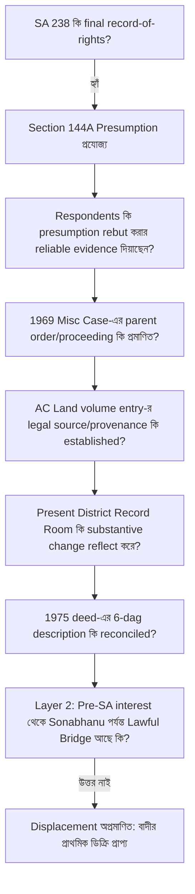

# জেলা জজ আদালত, টাঙ্গাইল

## আপীল মামলা নং ৩৮/২০২৬
### বাটোয়ারা মামলা নং ৬৬/২০১৬, সখিপুর সিভিল জজ আদালত হইতে উদ্ভূত

**হাতেম আলী ও অন্যান্য**
— আপীল্যান্ট/বাদী

**বনাম**

**আলহাজ উদ্দিন ও অন্যান্য**
— রেসপন্ডেন্ট/বিবাদী

# আপীল্যান্টপক্ষের পূর্ণাঙ্গ মাস্টার লিখিত যুক্তিতর্ক

## **Version 93 — Definitive Master Appellate Brief (Synthesized 6-Cluster Architecture)**

**তারিখ:** ১৭ আগস্ট ২০২৬  
**আদালত:** জেলা জজ আদালত, টাঙ্গাইল  

---

# প্রারম্ভিক নিবেদন ও এখতিয়ারগত স্পষ্টীকরণ (Opening Address & Jurisdictional Clarification)

**মহামান্য আদালত,**

সখিপুর সিভিল জজ আদালতের বাটোয়ারা মামলা নং ৬৬/২০১৬-এর ০৫-০৪-২০২৬ তারিখের খারিজ রায় ও ০৯-০৪-২০২৬ তারিখের ডিক্রির বিরুদ্ধে আপীল্যান্ট বাদীপক্ষের এই আপীল।

এই আপীলের নিষ্পত্তির জন্য সমগ্র জমিদারি ইতিহাস, ১৯৩৪ সালের কথিত পত্তন এবং পরবর্তী পারিবারিক বংশতালিকার প্রতিটি অস্পষ্টতা একসঙ্গে পুনর্গঠন করা আবশ্যক নহে। এই আপীলে কালানুক্রমিক ইতিহাসের চেয়ে সাক্ষ্যের আইনগত ক্রম (evidentiary hierarchy) অধিক গুরুত্বপূর্ণ।

রাষ্ট্রের অধিগ্রহণ-পরবর্তী জরিপে প্রস্তুত ও চূড়ান্তভাবে প্রকাশিত **SA ২৩৮ নং খতিয়ানে আব্দুল আলী ১৬ আনা একক রায়ত হিসেবে রেকর্ডভুক্ত**। State Acquisition and Tenancy Act, 1950-এর section 144A অনুযায়ী চূড়ান্তভাবে প্রকাশিত record-of-rights-এর প্রতিটি entry evidence হিসেবে গ্রহণযোগ্য এবং ভুল প্রমাণিত না হওয়া পর্যন্ত আইনত সঠিক বলিয়া অনুমিত হয় (presumed to be correct until proved incorrect)। 

আমরা বলিতেছি না যে SA ২৩৮ কখনো ভুল হইতে পারে না।

আমরা বলিতেছি না যে Revenue authority কোনো statutory procedure-এর অধীনে কখনো কোনো record update বা correction করিতে পারে না। বর্তমান আইনে section 143-এ clerical mistake correction এবং transfer, inheritance, subdivision, consolidation ইত্যাদির কারণে record update-এর ব্যবস্থা আছে; section 143C-তেও mutation/correction-এর procedure, notice, objection এবং hearing-এর সুস্পষ্ট বিধান রহিয়াছে।

### Jurisdictional Clarification (SAT Act Section 145A/145F বনাম দেওয়ানি বাটোয়ারা এখতিয়ার):
মহামান্য আদালত, শুরুতেই একটি এখতিয়ারগত বিষয় দ্ব্যর্থহীনভাবে স্পষ্ট করা প্রয়োজন:
* এই আপীলে কোনো জরিপ রেকর্ড বা চূড়ান্তভাবে প্রকাশিত খতিয়ান বাতিল বা সংশোধনের জন্য কোনো independent relief প্রার্থনা করা হইতেছে না (যাহা SAT Act Section 145A বা Land Survey Tribunal-এর এখতিয়ারভুক্ত হইতে পারে);
* বরং এটি সহ-শরীকদের মধ্যে সাধারণ দেওয়ানি এখতিয়ারে (General Civil Jurisdiction under CPC) একটি বাটোয়ারা আপীল, যেখানে জেলা সেটেলমেন্ট রেকর্ড রুমে সংরক্ষিত বহাল ও কার্যকর SA ২৩৮ নং খতিয়ানের সংবিধিবদ্ধ অনুমানের ভিত্তিতে পক্ষগণের স্বত্ব ও অংশ নির্ধারণ চাওয়া হইয়াছে;
* বাটোয়ারা মোকদ্দমার পূর্ণাঙ্গ নিষ্পত্তির স্বার্থে আনুষঙ্গিক স্বত্বের প্রশ্ন (Incidental question of title) বিচার ও নিষ্পত্তি করার সম্পূর্ণ দেওয়ানি এখতিয়ার আদালতের রহিয়াছে (*Chinmoy Chowdhury vs. Shanti Rani Chowdhury, 23 BLD (AD) 83*)।

**আমাদের মূল বক্তব্য অত্যন্ত সীমিত ও সুনির্দিষ্ট:**

> **"যে নির্দিষ্ট substantive পরিবর্তনের উপর বিবাদীপক্ষ বর্তমান স্বত্ব দাবি প্রতিষ্ঠা করিতেছে, সেই পরিবর্তনটি এই মামলার প্রমাণে কীভাবে, কোন legal source-এর মাধ্যমে, কোন competent proceeding-এ এবং কোন নির্ভরযোগ্য documentary trail অনুসরণ করিয়া ঘটিয়াছিল—তা প্রমাণিত হয় নাই।"**

অতএব প্রশ্নটি শুধু—
> **“SA ২৩৮ ভুল কি না?”** — তাহা নহে।

প্রকৃত বিচার্য প্রশ্ন:
> **“যে পক্ষ বলিতেছে SA ২৩৮ পরবর্তীতে ভুল, সংশোধিত অথবা displaced হইয়াছে—সেই particular corrective event-এর legal source, content, authority এবং lawful implementation কোথায়?”**

---

## শুনানিতে ৫ মিনিটের সরাসরি পাঠযোগ্য রোডম্যাপ (5-Minute Spoken Oral Script)

**১. ১ম মিনিট (The Legal Starting Point & State Record):**
> *মহামান্য আদালত, আমাদের দাবি আব্দুল করিমের কথিত পত্তন থেকে derivative নয়। CS ২ নং খতিয়ানে নালিশী জমি কোনো ব্যক্তিগত রায়তি নামে রেকর্ডভুক্ত ছিল না; জমিটি নবাব এস্টেটের খাস হিসেবে প্রতিফলিত। ১৯৫২ সালের State Acquisition-এর পর ১৯৫৬–১৯৬২ সালের SA জরিপ কার্যক্রমে রাষ্ট্র আব্দুল আলীকে ১৬ আনা একক রায়ত হিসেবে রেকর্ড করে এবং সেই রেকর্ড চূড়ান্তভাবে প্রকাশিত হয়। বর্তমানে জেলা Settlement Record Room-এ সংরক্ষিত সইমোহরি SA ২৩৮ রেকর্ড অপরিবর্তিত রহিয়াছে।*

**২. ২য় মিনিট (The Statutory Presumption & Evidentiary Advantage):**
> *মহামান্য আদালত, আপীল্যান্টপক্ষ এমন কোনো absolute proposition করিতেছে না যে revenue record কখনো সংশোধনযোগ্য নহে, অথবা final SA record কখনো ভুল হইতে পারে না। আমাদের বক্তব্য সুনির্দিষ্ট: Section 144A-এর অধীনে SA ২৩৮ একটি rebuttable statutory presumption বহন করে। বিবাদীপক্ষ সেই presumption অতিক্রম করিতে চাহিতেছে একটি alleged 1969 correction-এর ভিত্তিতে। অতএব তাহাদের particular case-এর legal source, proceeding, contents, authority এবং lawful implementation নির্ভরযোগ্য প্রমাণে প্রতিষ্ঠিত হওয়া আবশ্যক।*

**৩. ৩য় মিনিট (The Missing Foundation — The Central Question):**
> *এই মামলায় একটি AC Land volume entry আছে; কিন্তু সেই entry-এর legal source এবং provenance সম্পর্কে DW-4 নিজেই অজ্ঞতা প্রকাশ করিয়াছেন। কথিত Misc Case-এর parent order আদালতে নাই। বর্তমান District Settlement Record Room-এর SA ২৩৮-এও সোনাভানু recorded co-sharer হিসেবে প্রতিফলিত নন। মূল আদেশ বা আইনগত উৎস প্রমাণিত না হইলে, একটি পরবর্তী revenue entry-কে এককভাবে এমন প্রমাণ হিসেবে গ্রহণ করা নিরাপদ নহে, যাহা final SA record-এর statutory presumption-কে displaced বলিয়া গণ্য করার জন্য যথেষ্ট।*

**৪. ৪র্থ মিনিট (The Fatal Contradiction — 1975 Registered Deed):**
> *Respondents’ present theory: 1969 correction → SA 238 effectively one dag, Plot 1259.  
> Their own registered deed of 1975 (Exhibit Kha-1): SA 238 → six dags, including Plots 1259, 75, 3, 54, 1252 and 1220.  
> Question: If the 1969 correction had already altered the SA holding to one dag, why did their own subsequent registered deed describe six dags under the same khatian?  
> We do not say this contradiction by itself proves fabrication. We say it materially weakens the evidentiary reliability of the one-dag correction theory unless satisfactorily explained. (বঙ্গানুবাদ: এই বৈপরীত্য নিজে থেকেই জালিয়াতি প্রমাণ করে না, কিন্তু এক-দাগের কথিত সংশোধন তত্ত্বের নির্ভরযোগ্যতাকে মারাত্মকভাবে দুর্বল করে।)*

**৫. ৫ম মিনিট (The Structural Errors & Prayer):**
> *অতএব প্রশ্নটি revenue authority-এর সাধারণ ক্ষমতা আছে কি না—তাহা নহে। প্রশ্নটি হইল: এই particular substantive change আইনসম্মতভাবে ঘটিয়াছিল—ইহার reliable documentary proof কোথায়? আমাদের বিনীত বক্তব্য, রেকর্ডে সেই প্রমাণ যথেষ্টভাবে প্রতিষ্ঠিত হয় নাই। বিজ্ঞ ট্রায়াল কোর্ট এই evidentiary gap-সমূহ বিবেচনা না করিয়া SA ২৩৮-এর statutory presumption-কে খারিজ করিয়াছেন। ১ নং রেসপন্ডেন্ট সোলায়মান হোসেন (আব্দুল আলীর পুত্র) সোলেনামার মাধ্যমে বাটোয়ারায় সম্মতি দিয়াছেন। অতএব ট্রায়াল কোর্টের খারিজ রায় বাতিল করিয়া আব্দুল আলীর উত্তরাধিকারীদের মধ্যে ১৬ আনা হিস্যার ভিত্তিতে প্রাথমিক ডিক্রি প্রদানই ন্যায়বিচারের একমাত্র দাবি।*

---

# CLUSTER 1: সংবিধিবদ্ধ অনুমান, প্রমাণের দায়িত্ব ও Two-Layer Test

### ১.১ ধারা ১৪৪A-এর সংবিধিবদ্ধ অনুমান ও বাদীর প্রারম্ভিক সুবিধা
বর্তমান মামলার বিচারিক সূচনা বিন্দু (Starting Point) হইল রাষ্ট্রের চূড়ান্তভাবে প্রকাশিত **SA ২৩৮ নং খতিয়ান (প্রদর্শনী-৪)**। 

SAT Act-এর Section 144A অনুযায়ী চূড়ান্তভাবে প্রকাশিত record-of-rights-এর প্রতিটি entry evidence হিসেবে গণ্য এবং incorrect প্রমাণিত না হওয়া পর্যন্ত presumed correct:

> **Dayal Chandra Mondal vs. Assistant Custodian, 50 DLR 186:**  
> *"A record of rights finally published and revised under section 144A of the S.A.T. Act has a presumption of correctness and that presumption continues till it is rebutted by reliable evidence."*  
> *(বঙ্গানুবাদ: এস.এ.টি. আইনের ১৪৪A ধারার অধীনে চূড়ান্ত প্রকাশিত খতিয়ানের পেছনে সংবিধিবদ্ধ নির্ভুলতার অনুমান বিদ্যমান এবং নির্ভরযোগ্য সাক্ষ্য দ্বারা খণ্ডন না হওয়া পর্যন্ত তা অব্যাহত থাকে।)*

> **Government of Bangladesh vs. AKM Abdul Hye, 56 DLR (AD) 53:**  
> *"Records of rights prepared under the State Acquisition and Tenancy Act carry a statutory presumption of correctness which must be rebutted by positive and reliable evidence by the party asserting otherwise."*  
> *(বঙ্গানুবাদ: এসএটি আইনের অধীনে প্রস্তুতকৃত খতিয়ান সংবিধিবদ্ধ অনুমান বহন করে, যা বিপরীত দাবিদার পক্ষকে ইতিবাচক ও নির্ভরযোগ্য সাক্ষ্য দ্বারা খণ্ডন করতে হবে।)*

> **Azizul Hoque vs. Upendra Narayan Roy, 10 BLT (AD) 105:**  
> *"The burden of proving the error in the record of rights lies heavily on the challenging party."*  
> *(বঙ্গানুবাদ: খতিয়ানের ভুল প্রমাণের সম্পূর্ণ দায়ভার চ্যালেঞ্জকারী পক্ষের ওপর বর্তায়।)*

### ১.২ প্রমাণের দায়িত্বের সীমানা (Burden Allocation) ও Nuruddin Ahmed নজির
বিজ্ঞ ট্রায়াল কোর্ট *Bilquis Jahan (75 DLR 383)*-এর সাধারণ নীতির অপপ্রয়োগ করিয়া বাদীকে বিবাদীদের অপ্রমাণিত প্রতিটি অনুমানের বিপরীত প্রমাণ দেওয়ার অযৌক্তিক বোঝা চাপাইয়াছেন। কিন্তু আপিল বিভাগের সুস্পষ্ট সিদ্ধান্ত হইল:

> **Nuruddin Ahmed vs. Md. Jaman, 45 DLR (AD) 124:**  
> *"A trial court sometimes confuses 'plaintiff must prove' with 'plaintiff must disprove every counter-assertion'. This is erroneous."*  
> *(বঙ্গানুবাদ: বিচারিক আদালত প্রায়শই 'বাদীকে নিজের মামলা প্রমাণ করিতে হইবে' নীতির সহিত 'বাদীকে বিবাদীর প্রতিটি পাল্টা দাবি অপ্রমাণ করিতে হইবে' ধারণাকে গুলিয়ে ফেলেন, যাহা সম্পূর্ণ আইনগত ভুল।)*

### ১.৩ The Two-Layer Test (আপীলের মূল আইনি কাঠামো)
* **Layer 1 (Competing Root):** আব্দুল করিম কি পূর্বে এমন কোনো legally cognizable tenancy interest অর্জন করিয়াছিলেন, যাহার উত্তরাধিকার সোনাভানুর দিকে যায়?
* **Layer 2 (Displacement):** তর্কের খাতিরে যদি ধরিয়াও নেওয়া হয় যে কোনো pre-SA interest ছিল; তাহা সত্ত্বেও কীভাবে সেই interest আইনগতভাবে আব্দুল আলীর নামে final SA entry-কে অতিক্রম (displace) করিয়া সোনাভানুর জন্য present enforceable interest সৃষ্টি করিল?

> **"Even assuming, for argument's sake, that Abdul Karim had some pre-SA interest, that assumption does not by itself establish that Abdul Ali's finally published SA entry was wrong, nor does it establish the lawful creation of a present enforceable interest in Sona Bhanu."**  
> *(বঙ্গানুবাদ: তর্কের খাতিরে যদি সেই দাবি মানিয়াও নেওয়া হয়, তবুও তাহা নিজে থেকেই প্রমাণ করে না যে আব্দুল আলীর চূড়ান্তভাবে প্রকাশিত SA entry ভুল ছিল, এবং তাহা সোনাভানুর জন্য বর্তমান বলবৎযোগ্য স্বত্ব সৃষ্টির বৈধতাও প্রতিষ্ঠিত করে না।)*

### ১.৪ “বাদীর দুর্বলতা বিবাদীর স্বত্ব নহে” (Weakness of Plaintiff is Not Defendant's Title)
> **"Even assuming that some aspect of the plaintiffs’ case requires further proof, that does not automatically convert an unproved respondents’ title theory into a proved title."**

*অতএব বিজ্ঞ ট্রায়াল কোর্টের ইস্যু নং ১ ও ২-এর সিদ্ধান্ত আইন ও সাক্ষ্যের পরিপন্থী এবং বাতিলযোগ্য।*

---

# CLUSTER 2: মূল আদেশের অনুপস্থিতি ও ১৯৬৯ সালের মিস কেসের আইনি ত্রুটি

### ২.১ Missing Parent Order ও Evidentiary Gaps
বিবাদীপক্ষের সম্পূর্ণ মামলার ভিত্তি হইল কথিত **Misc Case No. 1181 of 1969**। কিন্তু উক্ত proceeding-এর application, order sheet, judgment, certified copy, parent file, notice/service—কোনোটিরই প্রাতিষ্ঠানিক প্রমাণ রেকর্ডে নাই।

একটি consequential entry-এর অস্তিত্ব parent proceeding-এর বিকল্প নহে। যুক্তির স্বাভাবিক ধারা:
$$\text{Parent Proceeding} \longrightarrow \text{Valid Order} \longrightarrow \text{Lawful Notice} \longrightarrow \text{Implementation} \longrightarrow \text{Corrected Record}$$

রেকর্ডে parent proceeding অনুপস্থিত থাকায় consequential entry-এর legal foundation অপ্রমাণিত থাকে।

### ২.২ মিস কেসে স্বত্ব নির্ধারণের এখতিয়ারহীনতা (Jurisdictional Bar)
প্রশাসনিক বা মিস কার্যধারায় দেওয়ানি স্বত্ব নির্ধারণের কোনো এখতিয়ার রাজস্ব কর্মকর্তার নাই:

> **Malay Miah vs. Maharam Ali, 27 BLD (HD) 544:**  
> *"Revenue officer has no jurisdiction to decide the question of title. Declaration of title requires a properly constituted civil suit."*  
> *(বঙ্গানুবাদ: মিস মোকদ্দমার সংক্ষিপ্ত প্রক্রিয়ায় স্বত্বের প্রশ্ন নিষ্পত্তি করার কোনো এখতিয়ার রাজস্ব কর্মকর্তার নাই। স্বত্ব ঘোষণার জন্য উপযুক্ত দেওয়ানি মামলা আবশ্যক।)*

### ২.৩ Evidence Act Section 114(g)-এর আলোকে প্রতিকূল অনুমান
> **"The absence of the best available evidence (parent order and proceeding file) may, in the context of the entire evidence, justify an adverse inference under the illustration to Section 114(g) of the Evidence Act."**

### ২.৪ Missing Document এখানে Peripheral নহে—Foundational
সাধারণ কোনো সহায়ক দলিল না থাকিলে আদালত পরিস্থিতিগত সাক্ষ্য দেখিতে পারেন; কিন্তু এখানে কথিত Misc Case-এর আদেশটি কোনো গৌণ দলিল নহে—উহাই সংশোধনের একমাত্র দাবিদার উৎস। মূল উৎস অপ্রমাণিত থাকিলে সম্পূর্ণ কাঠামো ধসিয়া পড়ে (*1 BLT (HD) 18*):

> **Fazlur Rahman vs. Bangladesh, 1 BLT (HD) 18:**  
> *"Where the parent document/order is not produced, secondary evidence or consequential entry carries no evidentiary value to prove title."*  
> *(বঙ্গানুবাদ: যেখানে মূল দলিল বা বিচারিক আদেশ উপস্থাপিত হয় না, সেখানে মাধ্যমিক সাক্ষ্য বা কোনো ফলাফলসূচক এন্ট্রি স্বত্ব প্রমাণের কোনো সাক্ষ্যগত মূল্য বহন করে না।)*

*অতএব বিজ্ঞ ট্রায়াল কোর্টের ইস্যু নং ২-এর সিদ্ধান্ত আইন ও সাক্ষ্যের পরিপন্থী এবং বাতিলযোগ্য।*

---

# CLUSTER 3: AC Land ভলিউম এন্ট্রি, রাজস্ব ক্ষমতা ও সাক্ষীর জবানবন্দি

### ৩.১ Clerical Correction ≠ Substantive Displacement (Section 143/143C-এর পরিধি)
আপীল্যান্টপক্ষ Revenue Officer-এর রেকর্ড রক্ষণাবেক্ষণের সংবিধিবদ্ধ ক্ষমতা অস্বীকার করিতেছে না। SAT Act-এর Section 143 এবং Section 143C-তে করণিক ভুল ও নামজারি/উত্তরাধিকার অন্তর্ভুক্তির সুনির্দিষ্ট আইনি প্রক্রিয়া রহিয়াছে। 

কিন্তু বর্তমান মামলাটি নিছক কোনো করণিক ভুল সংশোধনের নহে; বরং চূড়ান্ত রেকর্ডভুক্ত রায়ত আব্দুল আলীর ১৬ আনা স্বত্বের বিপরীতে সোনাভানুর নামে নতুন substantive interest সৃষ্টির দাবি। 

> **"Statutory power may exist in appropriate cases; but the existence of that general power does not prove that this particular substantive alteration was lawfully made."**

### ৩.২ নামজারি বা রেকর্ড সংশোধনে স্বত্ব সৃষ্টি হয় না
উচ্চ আদালতের ধারাবাহিক সিদ্ধান্ত অনুযায়ী নামজারি বা খতিয়ান এন্ট্রি কোনো মূল স্বত্ব সৃষ্টি বা ধ্বংস করে না:

> **Shahera Khatun vs. State, 53 DLR 19:**  
> *"Mutation does not confer any title, nor does its cancellation extinguish any title. If an order of mutation is passed without any legal basis, such order is a nullity in the eye of law."*  
> *(বঙ্গানুবাদ: নামজারি কোনো স্বত্ব প্রদান করে না, এবং উহার বাতিলকরণও কোনো স্বত্ব বিলুপ্ত করে না। কোনো আইনগত ভিত্তি ব্যতিরেকে নামজারি আদেশ প্রদান করা হইলে তাহা আইনের চোখে সম্পূর্ণ বাতিল/কার্যকারিতাহীন।)*

> **29 BLC 160:**  
> *"Correction of record of rights does not create any title in favour of a person in whose name the record of rights is corrected."*  
> *(বঙ্গানুবাদ: খতিয়ানের সংশোধন এমন কোনো ব্যক্তির অনুকূলে নতুন স্বত্ব সৃষ্টি করে না যাহার নামে খতিয়ানটি সংশোধিত হইয়াছে।)*

### ৩.৩ DW-4 (মোঃ আজম খান)-এর সুনির্দিষ্ট জবানবন্দি ও Provenance-এর ব্যর্থতা
বিবাদীদের তলবকৃত ভলিউমের সাক্ষী **DW-4 মোঃ আজম খান** আদালতে জেরায় দ্ব্যর্থহীনভাবে স্বীকার করিয়াছেন:
1. *“ভলিউমে মন্তব্য কলামে মিসকেস নাম্বার কত লিখা তা বুঝা যায় না।”*
2. *“কে বা কত তারিখ তা লিখা হয়েছে বলতে পারব না।”*
3. *“যোগসাজসে লিখা হয়েছে কিনা জানা নাই।”*
4. *“সোনা ভানুর নাম ভিন্ন কালিতে কেন লিখা বলতে পারব না।”*
5. *তিনি কোনো parent file বা মূল নথি উপস্থাপন করিতে পারেন নাই।*

অতএব:
> **"DW-4 could not establish the provenance, authorship, legal source or underlying proceeding of the entry."**

### ৩.৪ “ভিন্ন কালিতে লেখা” — সতর্ক পরিস্থিতিগত বিশ্লেষণ
ভিন্ন কালি নিজে থেকেই জালিয়াতির চূড়ান্ত প্রমাণ নহে; কিন্তু এটি এমন একটি সন্দেহজনক পরিস্থিতি যাহা এন্ট্রির উৎস, রচয়িতা এবং আইনগত ভিত্তি প্রমাণের আবশ্যকতাকে বহুগুণ বৃদ্ধি করে।

### ৩.৫ District Settlement Record Room-এ আব্দুল আলীর নাম বহাল
আজও জেলা প্রশাসকের কেন্দ্রীয় সেটেলমেন্ট রেকর্ড রুমে সংরক্ষিত চূড়ান্ত SA ২৩৮ নং খতিয়ানে আব্দুল আলী একক ১৬ আনা রায়ত হিসেবে বহাল। বিবাদীপক্ষ কোনো সংশোধিত SA ২৩৮-এর সইমোহরি কপি দাখিল করিতে পারে নাই।

*অতএব বিজ্ঞ ট্রায়াল কোর্টের ইস্যু নং ৩-এর সিদ্ধান্ত আইন ও সাক্ষ্যের পরিপন্থী এবং বাতিলযোগ্য।*

---

# CLUSTER 4: দালিলিক অসঙ্গতি ও স্ববিরোধিতা

### ৪.১ ১৯৭৫ সালের ৩৫৯৬ নং রেজিস্ট্রিকৃত দলিল — The One-Dag / Six-Dag Contradiction
বিবাদীপক্ষের বর্তমান দাবি: ১৯৬৯ সালের সংশোধনে SA ২৩৮ কেবল ১টি দাগে (১২৫৯ দাগ) সীমাবদ্ধ হইয়াছে।

অথচ বিবাদীপক্ষের নিজেদের দাখিলকৃত ও সম্পাদিত **১৯৭৫ সালের ৩৫৯৬ নং রেজিস্ট্রিকৃত দলিলে (Exhibit Kha-1)** SA ২৩৮ খতিয়ানের অধীনে ৬টি দাগের সুস্পষ্ট বর্ণনা রহিয়াছে:

| দাগ নং | জমির শ্রেণি/অবস্থান | ১৯৭৫ দলিলে বর্ণনা | বিবাদীদের বর্তমান থিওরি |
|---|---|---|---|
| **১২৫৯** | নালিশী জমি | অন্তর্ভুক্ত | একমাত্র দাবিদার দাগ |
| **৭৫** | অন্যান্য জোত | অন্তর্ভুক্ত | অস্বীকার/অনুল্লিখিত |
| **৩** | অন্যান্য জোত | অন্তর্ভুক্ত | অস্বীকার/অনুল্লিখিত |
| **৫৪** | অন্যান্য জোত | অন্তর্ভুক্ত | অস্বীকার/অনুল্লিখিত |
| **১২৫২** | অন্যান্য জোত | অন্তর্ভুক্ত | অস্বীকার/অনুল্লিখিত |
| **১২২০** | অন্যান্য জোত | অন্তর্ভুক্ত | অস্বীকার/অনুল্লিখিত |

> **“If the alleged 1969 correction had reduced SA 238 to one dag, why does the respondents’ own registered deed of 1975 describe six dags under the same khatian?”**

> **“The contradiction does not by itself prove fabrication. We say it materially weakens the evidentiary reliability of the one-dag correction theory unless satisfactorily explained.”**

### ৪.২ বেলুয়া খাতুনের পরিচয়গত অসঙ্গতি ও Selective Entry
* ১৯৭৫ সালের দলিলে বেলুয়া খাতুনের স্বামীর নাম **“সোবান”**; পক্ষান্তরে বিবাদীদের pleading-এ ভিন্ন পরিচয় বর্ণিত।
* বিবাদীদের কথিত উত্তরাধিকার তত্ত্বে আব্দুল করিমের অন্যান্য কন্যা/উত্তরাধিকারী (বেলুয়া ও কমলা) থাকা সত্ত্বেও কথিত ১৯৬৯ সালের সংশোধনে কেন কেবল সোনাভানুর নাম আসিল—তাহার কোনো যুক্তিসঙ্গত ব্যাখ্যা নাই।

### ৪.৩ SA ৯১ নং খতিয়ানের অভ্যন্তরীণ ত্রুটি
দাখিলকৃত কপিতে ১২৫২ দাগের পুনরাবৃত্তি ও ভিন্ন ভিন্ন আয়তনের উল্লেখ একটি material discrepancy সৃষ্টি করে, যাহার মূল কপি জেলা রেকর্ড রুমে অনুপস্থিত।

### ৪.৪ ১৯৫৭ সালের ২৩৯৮ নং রেজিস্ট্রিকৃত দলিল (সমসাময়িক দালিলিক সম্পর্ক)
২৩৯৮/১৯৫৭ নং দলিলটি (প্রদর্শনী-২) SA জরিপকালীন সময়ের সমসাময়িক নিবন্ধিত দলিল, যাহা SA ২৩৮-ভুক্ত ৩ নং দাগের ভূমির সহিত আব্দুল আলীর সমসাময়িক বাস্তব সম্পর্ক প্রমাণ করে (*Contemporaneous Corroborative Circumstance*)।

*অতএব বিজ্ঞ ট্রায়াল কোর্টের সিদ্ধান্ত আইন ও সাক্ষ্যের পরিপন্থী এবং বাতিলযোগ্য।*

---

# CLUSTER 5: পদ্ধতিগত আপত্তির খণ্ডন — Hotchpot ও পক্ষদোষ

### ৫.১ ১২৫৯ দাগের গাণিতিক সামঞ্জস্য (Arithmetical Verification)
* ১২৫৯ দাগের মোট সরকারি আয়তন: **৪.৭৭ একর = ৪৭৭ শতাংশ**
* সরকারি ১ নং খাস খতিয়ানভুক্ত জমি: **১.৩৭ একর = ১৩৭ শতাংশ**
* বাদীদের তফসিলভুক্ত নালিশী জমি: **৪.৭৭ − ১.৩৭ = ৩.৪০ একর = ৩৪০ শতাংশ** (নিখুঁত মিল)
* বিবাদীদের দাবিকৃত আয়তন: **৩.৪৯ + ১.৩৭ = ৪.৮৬ একর = ৪৮৬ শতাংশ** (৯ শতাংশ অতিরিক্ত—গাণিতিক অসম্ভবতা)

### ৫.২ একই দাগ ≠ একই প্রজাস্বত্ব (Separate Khatian Refutes Hotchpot)
একই দাগ নম্বরের মধ্যে সরকারি খাস জমি পৃথক খতিয়ানে এবং SA ২৩৮-এর জমি পৃথক রেকর্ডীয় পরিচয়ে বিদ্যমান। বাদীপক্ষ সরকারের খাস জমির উপর কোনো স্বত্ব বা বাটোয়ারা দাবি করে নাই। পৃথক খতিয়ানের জমি বাদ দিলে আংশিক বাটোয়ারার দোষ ঘটে না:

> **Shahjahan Akon vs. Murshida Khanam, 27 BLD (HD) 229:**  
> *"Separate khatians create separate tenancies; no hotchpot defect arises from leaving out adjacent government plots or land under different tenancies."*  
> *(বঙ্গানুবাদ: পৃথক খতিয়ান পৃথক প্রজাস্বত্ব সৃষ্টি করে; সংলগ্ন সরকারি জমি বা ভিন্ন খতিয়ানের জমি বাদ দিলে আংশিক বাটোয়ারার কোনো দোষ সৃষ্টি হয় না।)*

### ৫.৩ সরকারকে পক্ষভুক্ত না করার আপত্তি অমূলক (Necessary Party Test)
সহ-অংশীদারদের মধ্যে ব্যক্তিগত বাটোয়ারা মামলায়, যেখানে সরকারের বিরুদ্ধে কোনো প্রতিকার চাওয়া হয় নাই, সেখানে সরকার আবশ্যকীয় পক্ষ নহে:

> **Safaruddin vs. Fazlul Huq, 49 DLR (AD) 15:**  
> *"The Government is not a necessary party in a private partition suit between co-sharers where no relief is sought against the State."*  
> *(বঙ্গানুবাদ: সহ-অংশীদারদের মধ্যে ব্যক্তিগত বাটোয়ারা মামলায় সরকার আবশ্যকীয় পক্ষ নয়, যেখানে রাষ্ট্রের বিরুদ্ধে কোনো প্রতিকার চাওয়া হয়নি।)*

> **Syed Nurul Huda vs. Govt. of Bangladesh, 8 SCOB (2016) HCD 1:**  
> *"A suit for partition cannot fail merely for non-joinder of parties unless the party omitted is a necessary party."*  
> *(বঙ্গানুবাদ: বাদ পড়া পক্ষ আবশ্যকীয় পক্ষ না হলে কেবল পক্ষদোষের কারণে বাটোয়ারা মামলা খারিজ হতে পারে না।)*

### ৫.৪ ১ নং রেসপন্ডেন্ট সোলায়মান হোসেনের সোলেনামা (CPC Order XXIII Rule 3)
রেকর্ডভুক্ত মূল প্রজা আব্দুল আলীর একমাত্র জীবিত ওয়ারিশ পুত্র **১ নং রেসপন্ডেন্ট সোলায়মান হোসেন** আদালতে সোলেনামা দাখিল করিয়া বাটোয়ারায় পূর্ণ সম্মতি প্রদান করিয়াছেন। ফলে প্রমাণিত হয় যে মূল রেকর্ডীয় বংশধরদের মধ্যে কোনো বিরোধ নাই; বিরোধ কেবল বাইরের অপ্রমাণিত দাবিদারদের সহিত।

*অতএব বিজ্ঞ ট্রায়াল কোর্টের ইস্যু নং ৪-এর সিদ্ধান্ত আইন ও সাক্ষ্যের পরিপন্থী এবং বাতিলযোগ্য।*

---

# CLUSTER 6: সার্বিক সাক্ষ্য সংশ্লেষণ, ডিসিশন ট্রি ও Finding-Error Matrix

### ৬.১ দুর্বল প্রমাণের সমষ্টি মূল ভিত্তির বিকল্প নহে
> **"Missing foundation cannot be supplied by multiplication of weak circumstances."**

### ৬.২ আপীলের মীমাংসার ৪টি মৌলিক প্রশ্ন
1. আব্দুল করিমের alleged root tenancy-এর নির্ভরযোগ্য প্রমাণ কোথায়?
2. SA ২৩৮-এর চূড়ান্ত সংবিধিবদ্ধ অনুমান খণ্ডনের ইতিবাচক সাক্ষ্য কোথায়?
3. ১৯৬৯ সালের মিস কেসের মূল বিচারিক আদেশ ও কার্যধারা কোথায়?
4. মূল আদেশ ছাড়া স্থানীয় ভলিউম এন্ট্রি কীভাবে আব্দুল আলীর রেকর্ডীয় স্বত্ব স্থানচ্যুত করিল?

### ৬.৩ ট্রায়াল কোর্টের সিদ্ধান্ত বনাম আপীল ভুলের তুলনামূলক ছক (Finding vs. Error Matrix)

| ট্রায়াল কোর্টের সিদ্ধান্ত (ইস্যুভিত্তিক) | আপীল আদালতের দৃষ্টিতে ত্রুটি (Appellate Error) |
|---|---|
| **ইস্যু ১ (মূল প্রজা স্বত্ব):** আব্দুল করিমকে মূল রায়ত গণ্য করা | Foundation presumed, not proved — কোনো বৈধ পাট্টা/দাখিলা নাই |
| **ইস্যু ২ (SA ২৩৮-এর কার্যকারিতা):** SA ২৩৮ ভুল বলিয়া খারিজ | Section 144A presumption পর্যাপ্ত নির্ভরযোগ্য সাক্ষ্য ব্যতিরেকে খারিজ |
| **ইস্যু ৩ (১৯৬৯ মিস কেস ও ভলিউম):** AC Land ভলিউম এন্ট্রিকে প্রাধান্য | Parent order, jurisdiction ও provenance অপ্রমাণিত থাকা সত্ত্বেও গ্রহণ |
| **দলিলগত বিবেচনা:** ১৯৭৫ দলিলের বৈপরীত্য উপেক্ষা | ১-দাগ বনাম ৬-দাগের স্ববিরোধিতার কোনো বিচারিক ব্যাখ্যা রায়ে নাই |
| **ইস্যু ৪ (Hotchpot ও পক্ষদোষ):** আংশিক বাটোয়ারায় খারিজ | পৃথক খতিয়ানের সরকারি জমি বাদ থাকায় technical objection fatal নহে |

### ৬.৪ Appellate Decision Tree

---

# সমাপনী নিবেদন (Master Closing Submission)

**মহামান্য আদালত,**

আমরা বলছি না—SA ২৩৮ কখনো ভুল হতে পারে না।  
আমরা বলছি না—Revenue Officer-এর record maintenance-এর কোনো statutory power নেই।  
আমরা বলছি না—একটি volume entry কখনো কোনো evidentiary significance বহন করতে পারে না।  

আমাদের বক্তব্য অত্যন্ত সীমিত ও নির্দিষ্ট:
> **"একটি final SA record-এর বিরুদ্ধে যখন একটি specific substantive correction theory দাঁড় করানো হয়, তখন সেই particular correction-এর legal source, contents, authority, implementation এবং evidentiary manifestation নির্ভরযোগ্য প্রমাণে প্রতিষ্ঠিত হওয়া আবশ্যক।"**

> **“The question is not whether a correction was theoretically possible. The question is whether this particular correction, on this particular record, has been proved.”**

আমাদের বিনীত নিবেদন — **It has not.**

---

# প্রার্থিত প্রতিকার (Reliefs Sought)

অতএব মহামান্য আদালতের নিকট বিনীত প্রার্থনা—

**(ক)** সখিপুর সিভিল জজ আদালতের ০৫/০৪/২০২৬ তারিখের Judgment এবং ০৯/০৪/২০২৬ তারিখের Decree বাতিল ও রহিত (set aside) করা হউক;

**(খ)** জেলা সেটেলমেন্ট রেকর্ড রুমে সংরক্ষিত বহাল SA ২৩৮ নং খতিয়ানের ভিত্তিতে নালিশী ৩৪০ শতক জমিতে মূল রেকর্ডভুক্ত রায়ত আব্দুল আলীর বৈধ ওয়ারিশগণের মধ্যে **১৬ আনা হিস্যার বণ্টন** নির্ধারণপূর্বক এবং ১ নং রেসপন্ডেন্ট সোলায়মান হোসেনের সোলেনামার (CPC Order XXIII Rule 3) স্বীকৃতি প্রদান করিয়া বাদীপক্ষের অনুকূলে বাটোয়ারার **প্রাথমিক ডিক্রি (Preliminary Decree)** প্রদান করা হউক;

**(গ)** সরকারি ১ নং খাস খতিয়ানভুক্ত ১৩৭ শতক ভূমি বাটোয়ারার আওতাবহির্ভূত রাখিয়া কেবল ব্যক্তিগত ৩৪০ শতক ভূমিতে বিজ্ঞ অ্যাডভোকেট কমিশনার নিয়োগের মাধ্যমে সহম বণ্টনের নির্দেশ দেওয়া হউক;

**(ঘ) বিকল্পে (In the alternative):** যদি মহামান্য আদালত মনে করেন যে কোনো প্রক্রিয়াগত ত্রুটি রহিয়াছে, তবে CPC Order XLI Rule 23/23A অনুযায়ী মামলাটি বিচারিক আদালতে রিমান্ড (Remand) করিয়া আরজি সংশোধন ও পক্ষ সংযোজনের সুযোগ প্রদানপূর্বক পুনর্নিষ্পত্তির নির্দেশ দেওয়া হউক; এবং

**(ঙ)** সার্বিক ন্যায়বিচারের স্বার্থে আপীলটি খরচসহ মঞ্জুর করা হউক।

*সবিনয় নিবেদন ইতি।*

---

## 🔒 শুনানির জন্য “Nine-Step Locked Sequence” (মৌখিক শুনানির মূল ক্রম)

**১. SA 238 → Section 144A presumption**  
**২. Respondents allege later correction**  
**৩. Where is the parent order?**  
**৪. What exactly did that order decide?**  
**৫. What lawful process implemented it?**  
**৬. Where is the authoritative documentary manifestation of the alleged substantive change?**  
**৭. Why does the present District Record Room still record Abdul Ali?**  
**৮. Why does the respondents’ own 1975 deed describe six dags if their theory is one dag?**  
**৯. Even assuming Abdul Karim had some pre-SA interest, where is the lawful bridge from that interest to Sonabhanu’s present substantive interest? (The Layer 2 Fallback)**

---

## ⚠️ বিজ্ঞ কৌসুলির জন্য Filing-এর পূর্বে চূড়ান্ত যাচাইকরণ তালিকা

১. **Section 143 ও 143C-এর Statutory Scope:** Revenue authority-এর সাধারণ ক্ষমতা স্বীকার করিয়া এই specific entry-র lawful exercise অপ্রমাণিত থাকার যুক্তি বজায় রাখিবেন।  
২. **Section 145A ও 145F-এর Jurisdictional Boundary:** এই মামলায় খতিয়ান বাতিল/সংশোধনের দাবি করা হয় নাই, বরং বাটোয়ারার আনুষঙ্গিক স্বত্ব নির্ধারণে কার্যকর রেকর্ড হিসেবে SA 238-এর উপর নির্ভর করা হইয়াছে (*23 BLD AD 83*)।  
৩. **DW-4-এর জবানবন্দি:** জবানবন্দির উদ্ধৃতিসমূহ সার্টিফাইড কপির সাথে সতর্কতার সাথে মিলাইয়া নিবেন।  
৪. **Citation Verification:** 50 DLR 186, 56 DLR (AD) 53, 45 DLR (AD) 124, 27 BLD 229, 53 DLR 19, 1 BLT 18 ইত্যাদি নজিরের exact ratio original report হইতে নিশ্চিত করিবেন।  

---

**আপীল্যান্টগণের পক্ষে বিজ্ঞ কৌসুলি | জেলা জজ আদালত, টাঙ্গাইল | আপীল মামলা নং ৩৮/২০২৬**
