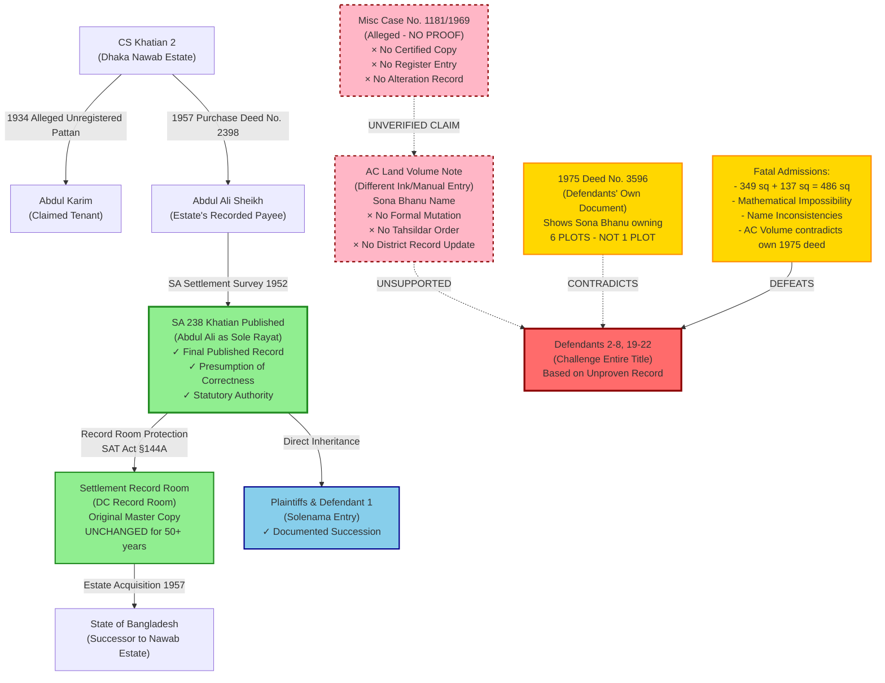

# Comprehensive Chain of Title - Tangail District Court Appeal 38/2026

## Enhanced Legal Timeline & Ownership Flow

## Key Legal Foundations

### Chain of Title (Plaintiffs) - ESTABLISHED
1. **CS Record** → Estate's own historical records
2. **Estate Return (1952)** → Abdul Ali as Tenant per Nawab Estate declaration
3. **SA 238 Khatian** → Officially published & finalized under SAT Act, §144A
4. **Record Room Custody** → Original stored in DC Record Room, UNALTERED for 50+ years
5. **State Succession** → 1957 Estate Acquisition; State recognizes SA 238
6. **Inheritance** → Direct succession documented via Solenama entry to Plaintiffs & Defendant 1

### Critical Legal Issues

#### ISSUE 1: SA 238 Khatian - State-Recognized Authority
- **Status**: Conclusively published under SAT Act, 1950, §144A
- **Presumption**: Statutory presumption of correctness (50 DLR 186; 5 SCOB 2015 AD 89)
- **Challenge Standard**: Extraordinarily high burden on challenger
- **Fact**: Original record unchanged in Record Room for 50+ years
- **Legal Result**: Cannot be collaterally challenged via unregistered pattan or misc case

#### ISSUE 2: 1934 Unregistered Pattan & Misc Case 1181/1969
**Pattan Defects:**
- Registration Act, 1908 violation (unregistered, >1 year tenure)
- No hereditary rights created under Zamindari system
- Automatically extinguished upon State Acquisition (Md. Shajahan Bhuiyan v. Md. Nurul Alam, 4 SCOB 2015 HCD 52)

**Misc Case Defects:**
- NO judgment, order, decree, or certified copy provided
- NO register entry of any modification
- Cannot adjudicate title (CPC §2(2), SRA §42, SAT Act §§143-144)
- Void ab initio without proper notification (Mainuddin Ahammed v. Bangladesh, 7 SCOB 2016 HCD 135)

#### ISSUE 3: AC Land Volume Note vs. Original SA Record
**Hierarchy of Authority:**
1. **Primary**: SA 238 in Record Room (Government of Bangladesh official record)
2. **Secondary**: AC Land Volume manual note (different ink, manual entry, procedural violations)

**No Valid Mutation Because:**
- No formal mutation application submitted
- No written notice to recorded owner (Abdul Ali)
- No Tahsildar field investigation
- No AC's signed formal order
- No District Record Room amendment
- No Register of Alterations entry

**Legal Finding:** AC volume note lacks presumptive value (Shahera Khatun v. State, 53 DLR 19; Md. Nurul Islam v. Charge Officer, 10 SCOB 2018 HCD 235)

#### ISSUE 4: Burden of Proof - Fundamental Trial Court Error
- **Plaintiffs' Burden**: Establish chain via SA 238 ✓ SATISFIED
- **Defendants' Burden**: Prove alteration of state record UNMET
- **Trial Court Error**: Reversed burden; required plaintiffs to disprove unproven assertion

**Legal Standard** (Evidence Act §103; Md. Azizul Hoque v. Md. Akbar Ali, 10 BLT AD 105):
> *"Burden of proving error lies on challenging party"*

#### ISSUE 5: Defendants' Own 1975 Deed (No. 3596) - Title Destroyer
- **Defendants' Claim in Appeal**: Sona Bhanu owns 1 plot (1259) per 1969 alleged modification
- **Defendants' Own 1975 Deed**: Sona Bhanu listed as owner of **6 PLOTS**
- **Mathematical Contradiction**: 
  - 349 sq meters (claimed) + 137 sq meters (government) = 486 sq meters total
  - Yet defendants claim inconsistent portions
- **Legal Effect** (Evidence Act §114(g), §115): Adverse inference & Estoppel against defendants

---

## Trial Court Errors (for Appellate Correction)

| Error | Issue | Legal Impact |
|-------|-------|--------------|
| **Error #1** | Preferred unproven oral assertion over published state record | Violates rule against secondary narratives |
| **Error #2** | Ignored unanswered questions: Why unchanged record room record after 50 years? | Shakes foundation of entire decision |
| **Error #3** | Failed to consider defendants' own 1975 deed showing 6 plots | Ignored admissions establishing estoppel |
| **Error #4** | Reversed burden of proof | Violated Evidence Act §103 and established case law |
| **Error #5** | Treated title challenge as minor clerical correction | Ignored heightened evidentiary standard for property claims |

---

## Core Legal Citations

### SA Khatian Authority (Tier 1)
- **50 DLR 186**: Statutory presumption of finally published SA record
- **5 SCOB (2015) AD 89**: SA Khatian bears statutory presumption; burden on challenger
- **Shafiullah v. Sultan Ahmad Mir, 6 BLD (AD) 70**: State recognition determines tenancy status

### Pattan & Misc Case Invalidity (Tier 1)
- **Md. Shajahan Bhuiyan v. Md. Nurul Alam, 4 SCOB [2015] HCD 52**: Unregistered patta extinguished by state acquisition
- **Md. Zahangir Alam v. Ziaul Haque, 20 SCOB [2025] HCD 12**: Misc case cannot adjudicate title
- **SAT Act, 1950, §§143-144**: Revenue Officer/Settlement Officer, not civil courts, can amend khatian

### Record Integrity (Tier 1)
- **Mainuddin Ahammed v. Bangladesh, 7 SCOB [2016] HCD 135**: Notice and hearing required; without them, amendment is void
- **Md. Nurul Islam v. Charge Officer, 10 SCOB [2018] HCD 235**: Unopened reopening of SA Khatian ultra vires
- **Shahera Khatun v. State, 53 DLR 19**: Volume note carries no presumptive value

### Burden of Proof (Tier 1)
- **Evidence Act, §103**: Party claiming special fact bears burden of proof
- **Md. Azizul Hoque v. Md. Akbar Ali, 10 BLT (AD) 105**: "Burden of proving error lies on challenging party"
- **Sufia Bewa v. Md. Aminul Islam, 19 SCOB [2024] HCD 85**: Weakness in plaintiff's case does not make defendant owner

### Estoppel & Admissions (Tier 1)
- **Evidence Act, §114(g)**: Adverse inference from unexplained inconsistency
- **Evidence Act, §115**: Party cannot contradict its own authenticated document

---

## Conclusion for Appellate Court

**For Plaintiffs to Prevail:**
Court need only trust existing state records.

**For Defendants to Prevail:**
Court must believe:
1. Nawab Estate erred in 1952 return
2. Settlement Officer erred in SA survey
3. Objection phase participants missed the error
4. Appeal phase participants missed the error
5. Revision phase participants missed the error
6. AND no valid amendment record exists for 50+ years

**Legal Principle**: *"Law accepts probability, not improbability"* (Appeal Brief, p. 348)

---

## Recommended Prayer

**Allow the Appeal and:**
- Restore SA 238 Khatian as binding evidence of title
- Set aside erroneous trial court judgment
- Declare Plaintiffs' right to partition and succession
- Award appropriate reliefs to appellants
