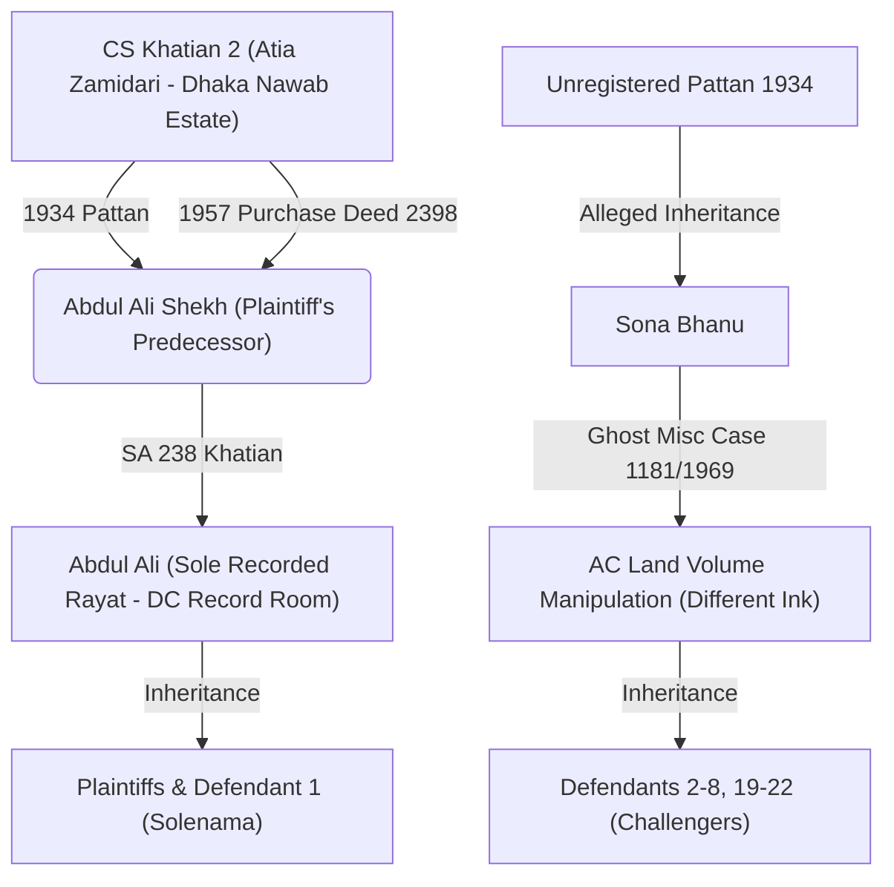

# AI Legal Architecture for Tangail Civil Appeal (আপীল মামলা নং ৩৮/২০২৬)

This repository serves as a structured knowledge base, legal research archive, and draft execution environment for processing appellate arguments before the **District Judge Court, Tangail**. It is specifically tailored for civil land law disputes under the State Acquisition and Tenancy (SAT) Act 1950, utilizing precedent matching from the Supreme Court Online Bulletin (SCOB) and a structured database of over 1,000 Supreme Court judgments.

---

## ⚖️ Active Case Profile

* **Appellate Court:** District Judge Court, Tangail
* **Appeal Case No:** আপীল মামলা নং ৩৮/২০২৬ (Admitted)
* **Trial Court:** Civil Judge Court, Sakhipur, Tangail
* **Original Suit No:** বাটোয়ারা মামলা নং ৬৬/২০১৬
* **Appellants (Plaintiffs):** হাতেম আলী ও অন্যান্য (Heirs of Abdul Ali Shekh)
* **Contesting Respondents (Defendants):** আলহাজ উদ্দিন ও অন্যান্য (Heirs of Sona Bhanu)
* **Solenama Respondent (Defendant 1):** সোলায়মান হোসেন (Agreed to partition via compromise)
* **Subject Property:** SA 238 Khatian, Hoteva Mouza, Sakhipur (Plot 1259, 340/349 decimals)



### 🔴 The Trial Court's Errors (Dismissal on 05/04/2026)
1. **Custodian Confusion:** The court prioritized the local AC Land office volume book (which listed Sona Bhanu's name in different ink) over the Certified Copy issued by the District Collector (DC) Central Record Room.
2. **Acceptance of Ghost Case:** The court accepted the defendants' claim that the ROR was corrected via Munsif Court Misc Case 1181/1969, despite the fact that **no copy of the order or decree** was ever produced in court.
3. **Burden of Proof Reversal:** The court placed the burden of proving that the record was *not* corrected on the plaintiffs, violating Section 103 of the Evidence Act.
4. **Erroneous Hotchpot & Non-joinder:** The court held that leaving out 137 decimals (Government khas land) in Plot 1259 was a Hotchpot defect and that not impleading the Government was fatal, failing to recognize that SA 238 forms a separate private tenancy.

### 🟢 The Admitted Grounds of Appeal
* **Primary Record Rule:** The Central DC Record Room is the sole statutory custodian of finally published RORs. Local AC Land volumes are subsidiary and prone to manipulation.
* **No Misc Case Record:** No record of Misc Case 1181/1969 exists in Munsif or District Judge archives. Under CPC, a Misc Case only produces an **Order** (CPC 2(14)), not a **Decree** (CPC 2(2)), and cannot adjudicate title.
* **Deed 3596/1975 Contradiction:** The defendants' own title deed lists 6 plots in SA 238, directly contradicting their claim that the khatian only has 1 plot (Plot 1259).
* **Government is Not a Necessary Party:** Private partition suits do not require impleading the Government unless khas land is sought to be partitioned (*Safaruddin vs. Fazlul Huq*, 49 DLR (AD) 15).

---

## 📂 Repository Directory Tree

```text
/
├── .gitignore                      # Git configuration file
├── extract.ps1                     # PowerShell script for text extraction from .docx
├── doc_content.txt                 # Extracted raw text from trial court judgments
├── Resource/                       # Primary knowledge base and raw materials
│   ├── SCOB/                       # Supreme Court Online Bulletin database (1–20 SCOB PDFs)
│   ├── Judgements/                 # Structured database of 1000+ Supreme Court cases (JSON files)
│   ├── Judgements_Search_References.md # 🔍 NEW — Reference library matching Keyword Bank (A-F)
│   ├── Trial Court Judgement.txt   # Trial Court judgment (Dismissal)
│   ├── Appeal Memo submited.txt    # Admitted Appeal Memorandum
│   └── [Various PDFs, DOCX, and MD files regarding case analysis]
└── Output/                         # Generated assets and finalized artifacts
    ├── appellate_argument_v54_Brief.md          # ⚖️ LATEST — Full brief with void record correction logic
    ├── appellate_argument_v54_Summary.md  # ⚡ LATEST — Concise court hearing aid
    ├── appellate_argument_v53_Brief.md          # Historical version
    ├── appellate_argument_v53_Summary.md  # Historical version
    ├── create_docx.js              # Node.js script for document conversion
    ├── package.json                # Node.js dependencies configuration
    └── package-lock.json           # Node.js dependencies lockfile
```

---

## 📈 Appellate Brief Version History

The arguments in `/Output` have evolved across several major iterations:

* **v1–v19 (Exploratory Ingestion):** Ingested the raw trial judgment and built the basic chronology of Abdul Ali's tenancy.
* **v20–v28 (Theoretical Development):** Drafted detailed, theoretical briefs (~50–112KB) establishing the **Broken Inheritance**, **Khas-to-SA Transition**, and **Approbate & Reprobate** doctrines.
* **v29 (Dual-File Protocol):** Established the policy of generating a detailed brief (`_vXX.md`) and a concise court hearing aid (`_vXX_Summary.md`) in sync.
* **v30–v33 (Streamlining):** Condensed the brief into **3 Core Questions** (70% value) and **4 Helper Questions** (30% value) for readability.
* **v34 (Search-Backed Reintegration):** Integrated advanced administrative and property law logic verified against the newly crawled `Resource/Judgements` database. Key additions include:
  1. *Section 143 Mutation vs. Section 144 ROR Revision:* Confirming AC Land's non-judicial status in mutation cases (*Aslam vs. Salauddin*, 18 BLC (HD) 235).
  2. *Nawab Estate Chief Manager Rule:* Proving unapproved pattan invalidity (*Harun-al-Rashid Mollah vs. Bangladesh*, 12 BLC (AD) 79).
  3. *Burden of Proof Shift:* Enforcing Section 103 of the Evidence Act (*tapash Kanti Majumder*, 26 BLC (AD) 78).
* **v35–v47:** Incremental refinement of arguments, integrating SCOB precedents and structural formatting.
* **v48–v53:** Advanced developments on Nawab Estate Transition, ROR Presumption, and oral arguments structure.
* **v54 (Void Record Correction & Summary Scope - Current):** Incorporated verified precedents **4 BLC (HD) 438** and **36 DLR (AD) 79** to dismantle the opponent's alleged record correction (Misc Case 1181/1969), establishing that a Section 143A ex-parte order passed without notice or inquiry is void ab initio, and that Section 143A cannot determine title.

---

## 🔍 Precedent Reference Encyclopedia (Resource/Judgements Results)

The `Resource/Judgements` database was crawled using a structured Node.js script mapping specific keyword banks. The top authorities identified are:

| Category | Key Precedent Citation | Parties | Key Legal Holding |
|---|---|---|---|
| **A. Nawab Estate to SA** | **12 BLC (AD) 79** | *Harun-al-Rashid vs. Bangladesh* | Rent receipts and settlements of Nawab Estate are void ab initio without the signature/approval of the Chief Manager. |
| | **42 DLR (HD) 434** | *Noor Mohammad Khan vs. Government* | Salami receipts/amalnamas received without Chief Manager approval cannot settle Court of Wards lands. |
| **B. SA Presumption** | **56 DLR (AD) 53** | *Government vs. AKM Abdul Hye* | Reverses HCD; confirms SA/RS records have full statutory presumption of correctness under Section 144A. |
| | **50 DLR (HD) 186** | *Dayal Chandra Mondal vs. Custodian* | ROR finally published under SAT Act has a presumption of correctness that stands until rebutted by reliable evidence. |
| **C. Mutation/Volume** | **18 BLC (HD) 235** | *Aslam vs. Salauddin* | A Revenue Officer acting in a mutation case under Section 143 **is not a Court**; mutation has no presumptive value. |
| | **1 BLT (HD) 18** | *Fazlur Rahman vs. Bangladesh* | SA Khatian changes in separate ink/handwriting without a parent judicial order sheet are fraudulent and must be excised. |
| **D. Partition Technicals** | **27 BLD (HD) 229** | *Shahjahan Akon vs. Murshida Khanam* | Separate khatians create separate tenancies; no hotchpot defect arises from leaving out adjacent government plots. |
| | **49 DLR (AD) 15** | *Safaruddin vs. Fazlul Huq* | The Government is not a necessary party in a partition suit between private co-sharers. |
| **E. Burden of Proof** | **26 BLC (AD) 78** | *Tapash Kanti vs. Sailandra Kumar* | Once the plaintiff proves the ROR record, the burden shifts to the defendant to prove the validity of any correction. |
| **F. Jurisdiction** | **27 BLD (HD) 544** | *Malay Miah vs. Maharam Ali* | Miscellaneous cases are summary proceedings and cannot adjudicate substantive civil title. |
| | **4 BLC (HD) 438** | *Osmanullah vs. Faizullah* | Ex-parte record correction order under Section 143A without serving notice is void ab initio. |
| | **36 DLR (AD) 79** | *Assistant Custodian vs. Bholanath Guha* | Section 143A is a summary proceeding concerned only with possession, not declaration of title. |

---

## 🤖 Agent Guidance & Rules

When operating within this workspace, AI agents must strictly follow these instructions:
1. **Single Source of Truth:** Refer to this `README.md` to align on case facts and current arguments.
2. **Dual-File Editing:** Any change to the legal arguments must be applied simultaneously to **both** the full brief (`_vXX.md`) and the concise hearing aid (`_vXX_Summary.md`).
3. **No Overwriting:** Never overwrite previous versions in `/Output`. Increment the version number (e.g. v33 -> v34).
4. **Citation Hygiene:** Only cite verified precedents from the `Resource/Judgements` or `Resource/SCOB` folders. Do not cite Indian or unverified rulings.
5. **PDF/DOCX Output:** Use Node.js `create_docx.js <version>` (e.g. `node create_docx.js v49`) to compile markdown drafts into court-ready document formats. **THIS IS A REQUIRED MANDATORY STEP FOR EVERY NEW VERSION.** The agent must run this command so the user has immediate access to the compiled documents.

---

## 📝 Implementation Progress

- [x] Ingest Trial Court Judgment and Appeal Memo.
- [x] Build search script mapping Keyword Groups A to F.
- [x] Run crawler and generate `Resource/Judgements_Search_References.md`.
- [x] Fully reorganize and structure `README.md` (Current).
- [x] Draft appellate brief version `appellate_argument_v54_Brief.md` integrating the void record correction logic.
- [x] Draft summary aid `appellate_argument_v54_Summary.md`.
- [x] Compile drafts to court-ready `.docx` format using conversion scripts.
- [ ] Final human-in-the-loop review.
